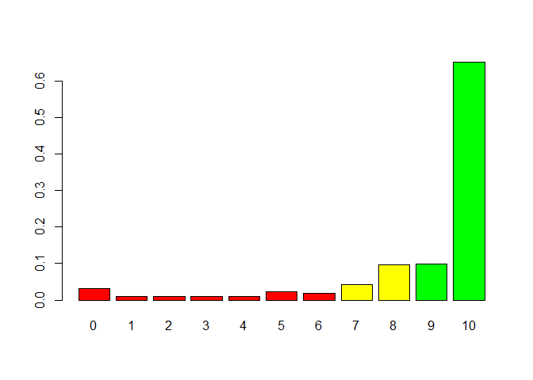
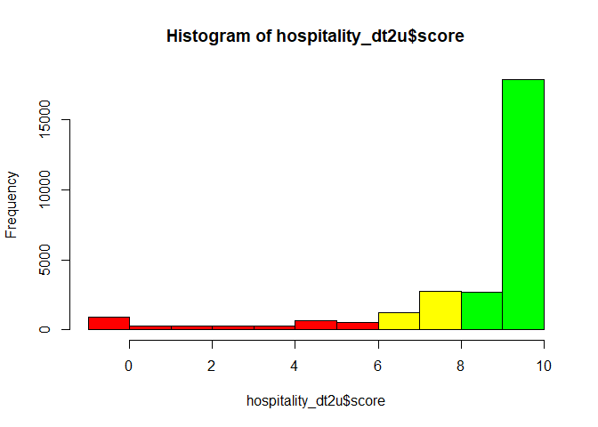
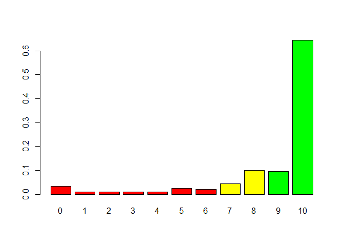
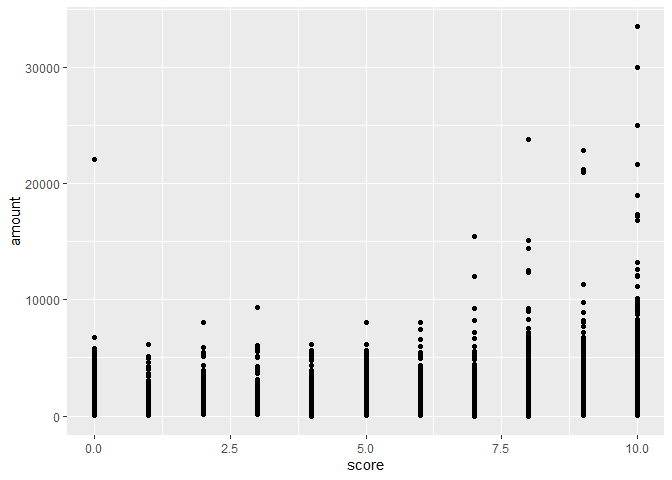

# R Programming: Customer Experience in R

## Example 


```r
# Importing the data.table
# ---
# 
library("data.table")
library(stats)
library(psych)
library(ggplot2)
```

```
## 
## Attaching package: 'ggplot2'
```

```
## The following objects are masked from 'package:psych':
## 
##     %+%, alpha
```

```r
# Reading our dataset
# ---
#fread accepts http and https URLs directly as well as operating system commands 
#such as sed and awk output.

hospitality_dt <- fread('http://bit.ly/HospitalityDataset')
View(hospitality_dt)
attach(hospitality_dt)
```


```r
# What is the structure of the data?
# ---
# 
head(hospitality_dt)
```

```
##    user_id gender timestamp survey_completion score amount          branch
## 1:  621602      M   11:58.1          TIMEDOUT     -   1320   Nairobi South
## 2:  242833      F   45:20.0          FINISHED     5   1460 Nairobi Central
## 3:  621602      M   00:36.0          TIMEDOUT     -   1270   Nairobi South
## 4:  621602      M   10:15.0          TIMEDOUT     -    700   Nairobi North
## 5: 6345755      M   54:58.1          TIMEDOUT     -    680   Nairobi North
## 6:  751525      M   35:52.7          TIMEDOUT     -    460    Nairobi West
```


```r
# How many variables and observations are there?
# 
ncol(hospitality_dt)
```

```
## [1] 7
```

```r
nrow(hospitality_dt)
```

```
## [1] 296852
```


```r
#learn more about the dataset
help(hospitality_dt)
```

```
## No documentation for 'hospitality_dt' in specified packages and libraries:
## you could try '??hospitality_dt'
```

```r
??hospitality_dt
```

```
## starting httpd help server ... done
```

```r
str(hospitality_dt)
```

```
## Classes 'data.table' and 'data.frame':	296852 obs. of  7 variables:
##  $ user_id          : int  621602 242833 621602 621602 6345755 751525 6591998 401557 17887026 1697459 ...
##  $ gender           : chr  "M" "F" "M" "M" ...
##  $ timestamp        : chr  "11:58.1" "45:20.0" "00:36.0" "10:15.0" ...
##  $ survey_completion: chr  "TIMEDOUT" "FINISHED" "TIMEDOUT" "TIMEDOUT" ...
##  $ score            : chr  "-" "5" "-" "-" ...
##  $ amount           : int  1320 1460 1270 700 680 460 570 1820 260 690 ...
##  $ branch           : chr  "Nairobi South" "Nairobi Central" "Nairobi South" "Nairobi North" ...
##  - attr(*, ".internal.selfref")=<externalptr>
```

```r
class(hospitality_dt)
```

```
## [1] "data.table" "data.frame"
```

```r
typeof(hospitality_dt) 
```

```
## [1] "list"
```

```r
length(hospitality_dt)
```

```
## [1] 7
```

```r
names(hospitality_dt) #display variable names
```

```
## [1] "user_id"           "gender"            "timestamp"        
## [4] "survey_completion" "score"             "amount"           
## [7] "branch"
```

```r
#attributes(hospitality_dt) #names(hospitality_dt), class(hospitality_dt), row.names(hospitality_dt)
```


```r
summary(hospitality_dt)
```

```
##     user_id            gender           timestamp         survey_completion 
##  Min.   :   61047   Length:296852      Length:296852      Length:296852     
##  1st Qu.:  374968   Class :character   Class :character   Class :character  
##  Median :  688580   Mode  :character   Mode  :character   Mode  :character  
##  Mean   : 2940497                                                           
##  3rd Qu.: 1257064                                                           
##  Max.   :18234387                                                           
##     score               amount         branch         
##  Length:296852      Min.   :    1   Length:296852     
##  Class :character   1st Qu.:  420   Class :character  
##  Mode  :character   Median :  770   Mode  :character  
##                     Mean   : 1079                     
##                     3rd Qu.: 1360                     
##                     Max.   :66250
```

```r
#distribution of input variables
table(hospitality_dt$gender)
```

```
## 
##      F      M 
## 145009 151843
```

```r
table(hospitality_dt$score)
```

```
## 
##      -      0      1     10      2      3      4      5      6      7      8 
## 260450   1161    333  23713    358    343    368    869    688   1495   3487 
##      9 
##   3587
```

```r
table(hospitality_dt$branch)
```

```
## 
##            #N/A Nairobi Central    Nairobi East   Nairobi North   Nairobi South 
##               1           53831           20208           58088           46222 
##    Nairobi West       Satellite 
##           79606           38896
```


```r
# What is the missing data?
# 
sum(is.na(hospitality_dt))
```

```
## [1] 0
```


```r
# NB: Let's deal with "-" in our scores variable
# Assumption is that those customers did not fill in the survey
# 
hospitality_dt$score[hospitality_dt$score == "-"] <- NA

head(hospitality_dt)
```

```
##    user_id gender timestamp survey_completion score amount          branch
## 1:  621602      M   11:58.1          TIMEDOUT  <NA>   1320   Nairobi South
## 2:  242833      F   45:20.0          FINISHED     5   1460 Nairobi Central
## 3:  621602      M   00:36.0          TIMEDOUT  <NA>   1270   Nairobi South
## 4:  621602      M   10:15.0          TIMEDOUT  <NA>    700   Nairobi North
## 5: 6345755      M   54:58.1          TIMEDOUT  <NA>    680   Nairobi North
## 6:  751525      M   35:52.7          TIMEDOUT  <NA>    460    Nairobi West
```


```r
# Getting rid of missing data, check size and preview
# Size of original dataset was 296852
# 
hospitality_dt1 <- na.omit(hospitality_dt)
nrow(hospitality_dt1)
```

```
## [1] 36402
```

```r
head(hospitality_dt1)
```

```
##     user_id gender timestamp survey_completion score amount          branch
## 1:   242833      F   45:20.0          FINISHED     5   1460 Nairobi Central
## 2:  1697459      M   39:01.6          TIMEDOUT     9    690    Nairobi East
## 3: 17144551      F   55:19.5          TIMEDOUT     0   1380 Nairobi Central
## 4: 17887216      F   00:38.1          TIMEDOUT     9    990   Nairobi South
## 5:   630299      F   03:49.9          TIMEDOUT     9    840    Nairobi West
## 6:   607011      M   20:46.1          TIMEDOUT    10    460   Nairobi South
```

```r
View(hospitality_dt1)
attach(hospitality_dt1)
```

```
## The following objects are masked from hospitality_dt:
## 
##     amount, branch, gender, score, survey_completion, timestamp,
##     user_id
```

```r
str(hospitality_dt1)
```

```
## Classes 'data.table' and 'data.frame':	36402 obs. of  7 variables:
##  $ user_id          : int  242833 1697459 17144551 17887216 630299 607011 17249001 6345132 17237328 17887747 ...
##  $ gender           : chr  "F" "M" "F" "F" ...
##  $ timestamp        : chr  "45:20.0" "39:01.6" "55:19.5" "00:38.1" ...
##  $ survey_completion: chr  "FINISHED" "TIMEDOUT" "TIMEDOUT" "TIMEDOUT" ...
##  $ score            : chr  "5" "9" "0" "9" ...
##  $ amount           : int  1460 690 1380 990 840 460 1200 2230 1080 1110 ...
##  $ branch           : chr  "Nairobi Central" "Nairobi East" "Nairobi Central" "Nairobi South" ...
##  - attr(*, ".internal.selfref")=<externalptr>
```

```r
class(hospitality_dt1)
```

```
## [1] "data.table" "data.frame"
```

```r
typeof(hospitality_dt1) 
```

```
## [1] "list"
```

```r
length(hospitality_dt1)
```

```
## [1] 7
```

```r
names(hospitality_dt1) #display variable names
```

```
## [1] "user_id"           "gender"            "timestamp"        
## [4] "survey_completion" "score"             "amount"           
## [7] "branch"
```

```r
summary(hospitality_dt1)
```

```
##     user_id            gender           timestamp         survey_completion 
##  Min.   :   61047   Length:36402       Length:36402       Length:36402      
##  1st Qu.:  473412   Class :character   Class :character   Class :character  
##  Median :  941226   Mode  :character   Mode  :character   Mode  :character  
##  Mean   : 4362453                                                           
##  3rd Qu.: 2616159                                                           
##  Max.   :18234387                                                           
##     score               amount         branch         
##  Length:36402       Min.   :    1   Length:36402      
##  Class :character   1st Qu.:  430   Class :character  
##  Mode  :character   Median :  800   Mode  :character  
##                     Mean   : 1123                     
##                     3rd Qu.: 1420                     
##                     Max.   :33520
```

```r
#distribution of input variables
table(hospitality_dt1$gender)
```

```
## 
##     F     M 
## 18138 18264
```

```r
table(hospitality_dt1$score)
```

```
## 
##     0     1    10     2     3     4     5     6     7     8     9 
##  1161   333 23713   358   343   368   869   688  1495  3487  3587
```

```r
table(hospitality_dt1$amount)
```

```
## 
##     1     2     5    10    20    30    40    50    60    70    80    85    90 
##    10     1     1     6     4     5    11     8     7     6     6     1    10 
##    95    99   100   110   120   128   130   136   140   150   152   160   162 
##     1     1    63    12    10     1     7     1    12    31     3   116     3 
##   168   170   175   176   180   184   185   190   192   200   202   208   210 
##     1   607     1    29   110     3     6    73     7   702     1     7    63 
##   211   215   216   220   230   234   240   250   256   258   260   264   265 
##     2     1     3  1310   353     2   155   271     2     1   284     1     2 
##   270   280   290   293   296   300   304   305   308   310   315   320   330 
##   555    71   294     1     9   352     2     2     1   208     1   123   144 
##   336   337   340   347   349   350   352   356   360   367   368   370   375 
##     9     2   218     1     1   173    13     1   142     1     3   577     1 
##   377   380   384   385   388   390   391   392   393   395   398   400   405 
##     1   138     7     6     1   317     1     1     1     3     1   631     2 
##   406   408   410   416   420   422   424   425   430   432   440   448   450 
##     1     1    89     1   488     1     2     1   180     1   773     1   231 
##   460   465   470   472   480   490   493   495   498   500   510   512   515 
##   274     1   469     1   336   242     1     1     1   408   137     1     1 
##   520   525   527   528   530   534   540   544   550   552   555   560   568 
##   274     1     1     1   250     1   270     1   194     2     4   196     2 
##   570   576   580   590   592   600   604   605   608   610   615   616   620 
##   194     2   199   184     1   335     1     4     1   140     1     1   213 
##   624   625   630   640   650   656   660   663   664   666   670   672   680 
##     3     2   168   282   146     1   263     2     1     1   169     3   174 
##   688   690   696   700   702   704   707   710   720   725   728   730   735 
##     3   316     3   284     1     2     1   166   169     1     1   207     2 
##   736   740   748   750   752   755   760   765   768   770   780   790   792 
##     2   337     1   226     2     2   145     1     1   159   247   118     2 
##   800   808   809   810   816   820   828   830   832   840   847   850   853 
##   316     1     1   140     1   153     1   128     1   253     1   131     1 
##   860   864   870   872   880   886   888   890   900   904   905   910   920 
##   210     2   127     4   298     1     1   248   194     1     1   169   267 
##   928   930   932   940   945   948   950   952   960   965   970   975   980 
##     2   163     1   223     1     1   192     1   185     1   133     1   169 
##   985   987   990   996  1000  1006  1008  1010  1020  1021  1030  1035  1040 
##     1     1   171     1   350     1     2   121   122     1   116     1   173 
##  1047  1050  1053  1060  1065  1070  1080  1090  1097  1100  1104  1110  1112 
##     1   147     2   148     1   114   163   185     1   155     1   134     1 
##  1120  1128  1130  1135  1136  1140  1150  1155  1160  1170  1175  1180  1185 
##   129     2   106     1     2   152   161     1   140    99     1   184     1 
##  1190  1200  1204  1208  1210  1215  1220  1230  1240  1244  1250  1255  1256 
##   108   176     1     1   116     1   126    97    96     1    95     1     1 
##  1260  1270  1280  1285  1290  1295  1296  1300  1310  1320  1330  1340  1350 
##   111   104   106     1   103     1     1   125    91   125    83    98   101 
##  1360  1364  1370  1378  1380  1385  1390  1400  1405  1410  1420  1430  1435 
##    85     1    77     1    92     1    93    97     1    82    83    67     1 
##  1440  1450  1460  1470  1480  1485  1490  1493  1500  1510  1520  1530  1540 
##    91    56    72    71    88     1    55     1   119    65    66    59    80 
##  1550  1560  1565  1570  1575  1580  1584  1590  1594  1600  1608  1610  1620 
##    65    83     1    64     1    49     1    53     1    79     1    52    58 
##  1630  1640  1645  1650  1659  1660  1670  1680  1690  1700  1705  1706  1710 
##    59    64     1    54     1    73    54    56    47    72     1     1    55 
##  1712  1720  1730  1735  1740  1750  1751  1760  1770  1780  1790  1800  1810 
##     1    59    59     1    52    61     1    65    48    60    48    63    60 
##  1820  1826  1830  1836  1840  1850  1860  1870  1880  1890  1900  1910  1920 
##    52     1    49     1    59    46    61    51    48    39    67    50    61 
##  1930  1935  1940  1950  1960  1970  1980  1984  1990  2000  2010  2020  2030 
##    31     1    52    53    54    33    68     1    31   132    43    47    45 
##  2040  2050  2060  2064  2070  2080  2082  2090  2100  2110  2112  2120  2130 
##    56    33    38     1    44    46     1    55    40    38     1    43    37 
##  2140  2150  2160  2170  2180  2190  2200  2210  2220  2230  2240  2248  2250 
##    48    39    45    55    62    48    57    41    38    43    46     1    35 
##  2260  2270  2272  2280  2290  2300  2305  2310  2320  2330  2340  2346  2350 
##    50    32     1    55    44    58     1    43    53    43    51     1    45 
##  2360  2370  2380  2390  2400  2410  2420  2424  2430  2440  2450  2460  2470 
##    51    39    45    26    47    41    38     1    45    50    36    54    50 
##  2480  2490  2500  2510  2520  2530  2540  2550  2560  2570  2580  2590  2592 
##    33    29    56    29    46    27    31    27    34    41    48    18     1 
##  2600  2610  2620  2630  2632  2640  2649  2650  2660  2670  2680  2690  2700 
##    34    42    32    27     1    45     1    24    39    29    38    23    31 
##  2710  2720  2727  2730  2740  2750  2760  2770  2780  2790  2800  2810  2820 
##    25    23     1    22    24    23    30    29    27    27    30    23    21 
##  2824  2830  2840  2850  2860  2870  2880  2890  2900  2910  2920  2930  2940 
##     1    20    26    18    20    14    30    18    22    21    17    20    21 
##  2950  2960  2970  2971  2980  2990  3000  3010  3020  3030  3035  3040  3050 
##    16    18    15     1    20    23    46    10    14    17     1    15    14 
##  3060  3070  3080  3090  3100  3110  3120  3130  3140  3150  3160  3170  3180 
##    12    18    11    14     6    13    16    13    14    22    10    11    10 
##  3190  3200  3210  3220  3230  3240  3250  3260  3270  3280  3290  3300  3310 
##    12    27    15    16     9    12    15    10     9    14    13    16    10 
##  3320  3330  3340  3350  3360  3370  3376  3380  3390  3400  3410  3420  3430 
##    11     7    12     9     8    14     1    13    11    11     7     8     6 
##  3440  3450  3460  3470  3480  3490  3500  3510  3520  3530  3540  3550  3560 
##    12     8     6    11    11    14    15     3     9     9    12     8     9 
##  3570  3580  3590  3600  3610  3620  3630  3640  3650  3660  3670  3680  3690 
##     8    15    10    47     5     7     7     5     6    16    11     8     6 
##  3700  3710  3720  3730  3740  3750  3760  3770  3780  3790  3800  3810  3820 
##    27     6    11     7     8     7     5     6     9     5     8    14     3 
##  3830  3840  3848  3850  3860  3870  3880  3890  3900  3910  3920  3930  3940 
##     9     9     1     3     6     6     8     8     9    11     8     9     7 
##  3950  3960  3970  3980  3990  3999  4000  4010  4020  4030  4040  4050  4060 
##     2     8     8     6     8     1    22     5     4     4     5     3     8 
##  4070  4080  4090  4100  4110  4120  4130  4140  4150  4160  4170  4180  4190 
##     9     5     5     4     5     5     6     8     1     6    10     4    10 
##  4200  4210  4220  4230  4240  4250  4260  4270  4280  4290  4300  4310  4320 
##     9     9     4     4     4     8     6     6     8     1     7     1     3 
##  4330  4340  4350  4360  4370  4380  4400  4410  4420  4430  4440  4450  4460 
##     3     4     3     4     4     3     3     1     6     2     4     6     4 
##  4462  4470  4480  4490  4500  4510  4520  4530  4540  4550  4560  4570  4580 
##     1     1     3     6     5     4     2     3     4     1     1     3     3 
##  4590  4600  4610  4620  4630  4650  4660  4670  4680  4690  4700  4710  4720 
##     1     1     4     3     2     1     6     1     2     2     5     2     7 
##  4730  4740  4750  4760  4770  4780  4790  4800  4810  4820  4830  4840  4850 
##     3     3     2     1     2     1     3     5     4     2     1     5     3 
##  4860  4870  4880  4890  4900  4910  4920  4930  4940  4950  4960  4972  4980 
##     4     4     3     2     3     4     4     2     4     1     2     1     1 
##  4990  5000  5010  5020  5030  5040  5050  5060  5070  5080  5090  5100  5110 
##     4    14     4     1     3     2     2     2     2     3     2     1     2 
##  5120  5130  5140  5150  5160  5170  5180  5190  5200  5210  5220  5230  5240 
##     2     3     1     2     3     4     2     1     1     2     3     1     4 
##  5250  5260  5280  5290  5300  5310  5320  5330  5340  5350  5360  5370  5380 
##     2     1     1     4     2     3     2     1     4     4     2     1     3 
##  5390  5400  5410  5420  5430  5440  5450  5460  5480  5490  5500  5510  5520 
##     2     3     1     1     4     4     3     1     5     2     4     2     1 
##  5530  5540  5550  5560  5570  5580  5590  5600  5610  5620  5630  5640  5650 
##     2     3     2     1     3     3     2     1     3     2     1     2     4 
##  5660  5670  5680  5690  5710  5730  5740  5750  5760  5780  5800  5810  5820 
##     4     1     3     2     3     1     2     3     3     1     2     3     1 
##  5830  5880  5890  5900  5920  5940  5950  5960  5980  6000  6010  6020  6030 
##     3     1     2     2     1     1     1     3     1     6     2     1     1 
##  6060  6070  6090  6100  6120  6130  6140  6150  6160  6170  6180  6190  6200 
##     1     1     1     3     2     1     2     1     3     1     1     1     1 
##  6230  6240  6280  6300  6310  6320  6340  6370  6380  6390  6400  6410  6420 
##     3     1     1     1     1     1     1     1     1     1     2     1     2 
##  6430  6440  6450  6460  6480  6490  6500  6510  6520  6540  6550  6560  6570 
##     1     1     2     2     3     2     2     1     2     3     1     1     2 
##  6580  6590  6600  6620  6630  6690  6700  6710  6720  6740  6780  6790  6900 
##     1     1     1     1     1     1     3     3     2     2     1     1     1 
##  6930  6950  7000  7010  7060  7070  7072  7090  7128  7140  7150  7160  7170 
##     2     1     1     1     1     1     1     1     1     1     2     1     1 
##  7180  7190  7200  7230  7350  7410  7450  7460  7470  7510  7520  7600  7630 
##     1     1     1     1     1     1     1     1     1     1     1     1     1 
##  7710  7730  7740  7770  7780  7970  7990  8000  8020  8030  8090  8140  8160 
##     2     1     1     1     1     1     1     2     1     1     4     1     1 
##  8190  8210  8230  8250  8260  8280  8290  8300  8330  8720  8740  8780  8800 
##     1     1     1     1     1     1     2     1     1     1     1     1     1 
##  8830  8890  9000  9020  9040  9210  9220  9250  9270  9279  9350  9370  9400 
##     1     1     1     1     1     1     1     2     1     1     1     1     1 
##  9440  9580  9600  9655  9720  9780  9800  9930 10000 10130 10150 10270 10410 
##     1     1     1     1     1     1     1     1     2     1     1     1     1 
## 11150 11360 12000 12100 12330 12540 12580 12840 13230 13770 14410 15080 15440 
##     1     1     2     1     1     1     1     1     1     1     1     1     1 
## 16575 16820 17160 17380 17455 18960 20139 20970 21220 21640 22130 22900 23820 
##     1     1     1     1     1     1     1     1     1     1     1     1     1 
## 25000 30000 30670 33520 
##     1     1     1     1
```

```r
table(hospitality_dt1$branch)
```

```
## 
##            #N/A Nairobi Central    Nairobi East   Nairobi North   Nairobi South 
##               1            6405            2718            6694            5749 
##    Nairobi West       Satellite 
##            8791            6044
```


```r
# What is the overall proportion of repeat customers?
#duplicated() function uses logical values to determine duplicated values.  

#duplicated(hospitality_dt1$user_id)

sum(duplicated(hospitality_dt1$user_id))
```

```
## [1] 6749
```

```r
dim(hospitality_dt1[duplicated(hospitality_dt1$user_id),])[1] #gives you number of duplicates
```

```
## [1] 6749
```

```r
table(duplicated(hospitality_dt1$user_id))
```

```
## 
## FALSE  TRUE 
## 29653  6749
```

```r
mean(duplicated(hospitality_dt1$user_id))
```

```
## [1] 0.1854019
```

```r
sum(duplicated(hospitality_dt1$user_id)) / nrow(hospitality_dt1)
```

```
## [1] 0.1854019
```


```r
# How many times do customers come back on average?


#unique() function uses numeric indicators to determine unique values.

library(plyr)

#unique(hospitality_dt1$user_id)

#count(unique(hospitality_dt1$user_id))

#table(unique(hospitality_dt1$user_id))

dim(hospitality_dt1[unique(hospitality_dt1$user_id),])[1] #gives you number of uniques
```

```
## [1] 29653
```


```r
# How many customers are repeat customers per branch?
#   
sum(duplicated(hospitality_dt1[,c('user_id','branch')]))
```

```
## [1] 4574
```


```r
# What is the NPS?
# 

# Importing our NPS library
# 
library(NPS)

# Converting score column to numeric
#
hospitality_dt1$score <- as.numeric(as.character(hospitality_dt1$score))

# Computing our NPS
nps(hospitality_dt1$score)
```

```
## [1] 0.6367782
```


```r
# Here are the proportions of respondents giving each Likelihood to
# recommend response
#
prop.table(table(hospitality_dt1$score))
```

```
## 
##           0           1           2           3           4           5 
## 0.031893852 0.009147849 0.009834624 0.009422559 0.010109335 0.023872315 
##           6           7           8           9          10 
## 0.018900060 0.041069172 0.095791440 0.098538542 0.651420252
```


```r
# Plotting a histrogram of the scores
# 

# Lets first import tidyverse
#
library(tidyverse)
```

```
## -- Attaching packages -------------------------------------------------------------------------- tidyverse 1.3.0 --
```

```
## v tibble  2.1.3     v dplyr   0.8.3
## v tidyr   1.0.0     v stringr 1.4.0
## v readr   1.3.1     v forcats 0.4.0
## v purrr   0.3.3
```

```
## -- Conflicts ----------------------------------------------------------------------------- tidyverse_conflicts() --
## x ggplot2::%+%()     masks psych::%+%()
## x ggplot2::alpha()   masks psych::alpha()
## x dplyr::arrange()   masks plyr::arrange()
## x dplyr::between()   masks data.table::between()
## x purrr::compact()   masks plyr::compact()
## x dplyr::count()     masks plyr::count()
## x dplyr::failwith()  masks plyr::failwith()
## x dplyr::filter()    masks stats::filter()
## x dplyr::first()     masks data.table::first()
## x dplyr::id()        masks plyr::id()
## x dplyr::lag()       masks stats::lag()
## x dplyr::last()      masks data.table::last()
## x dplyr::mutate()    masks plyr::mutate()
## x dplyr::rename()    masks plyr::rename()
## x dplyr::summarise() masks plyr::summarise()
## x dplyr::summarize() masks plyr::summarize()
## x purrr::transpose() masks data.table::transpose()
```

```r
hist(
  hospitality_dt1$score, breaks = -1:10,
  col = c(rep("red", 7), rep("yellow", 2), rep("green", 2))
)
```

<!-- -->


```r
# Here's a barplot. It's very similar, though for categorical responses
# it's often slightly easier to interpret
#
barplot(
 prop.table(table(hospitality_dt1$score)),
 col = c(rep("red", 7), rep("yellow", 2), rep("green", 2))
)
```

<!-- -->


```r
# Is there a relationship between NPS segment and amount spent? 
#  
ggplot(hospitality_dt1, aes(x=score, y=amount)) + geom_point()
```

<!-- -->

## Exercise


```r
#Build a data model with unique id only 


hospitality_dt1[!duplicated(hospitality_dt1$user_id),] #gives you unique rows
```

```
##         user_id gender timestamp survey_completion score amount          branch
##     1:   242833      F   45:20.0          FINISHED     5   1460 Nairobi Central
##     2:  1697459      M   39:01.6          TIMEDOUT     9    690    Nairobi East
##     3: 17144551      F   55:19.5          TIMEDOUT     0   1380 Nairobi Central
##     4: 17887216      F   00:38.1          TIMEDOUT     9    990   Nairobi South
##     5:   630299      F   03:49.9          TIMEDOUT     9    840    Nairobi West
##    ---                                                                         
## 29649:   423355      M   00:28.5          FINISHED    10   1040       Satellite
## 29650:  1235116      M   04:42.4          TIMEDOUT     8    580    Nairobi West
## 29651: 18205871      M   40:54.7          FINISHED     3   1600   Nairobi South
## 29652:   677307      F   25:32.0          FINISHED    10    570    Nairobi West
## 29653:    97324      F   54:03.2          FINISHED    10    530 Nairobi Central
```

```r
#Data with unique id only
hospitality_dt2u <- hospitality_dt1[!duplicated(hospitality_dt1$user_id),]
View(hospitality_dt2u)
attach(hospitality_dt2u)
```

```
## The following objects are masked from hospitality_dt1:
## 
##     amount, branch, gender, score, survey_completion, timestamp,
##     user_id
```

```
## The following objects are masked from hospitality_dt:
## 
##     amount, branch, gender, score, survey_completion, timestamp,
##     user_id
```

```r
nrow(hospitality_dt2u)
```

```
## [1] 29653
```

```r
mean(hospitality_dt2u$amount)
```

```
## [1] 1139.029
```

```r
# Converting score column to numeric
hospitality_dt2u$score <- as.numeric(as.character(hospitality_dt2u$score))

# Computing our NPS
nps(hospitality_dt2u$score)
```

```
## [1] 0.6227026
```

```r
# proportions of respondents giving each Likelihood to

prop.table(table(hospitality_dt2u$score))
```

```
## 
##           0           1           2           3           4           5 
## 0.033824571 0.009476276 0.010251914 0.009712339 0.010218190 0.024550636 
##           6           7           8           9          10 
## 0.019627019 0.042963612 0.099011904 0.096516373 0.643847166
```

```r
#Histogram

hist(
  hospitality_dt2u$score, breaks = -1:10,
  col = c(rep("red", 7), rep("yellow", 2), rep("green", 2))
)
```

<!-- -->

```r
#Barplot

barplot(
 prop.table(table(hospitality_dt2u$score)),
 col = c(rep("red", 7), rep("yellow", 2), rep("green", 2))
)
```

<!-- -->

```r
ggplot(hospitality_dt2u, aes(x=score, y=amount)) + geom_point()
```

<!-- -->


```r
#For the unique userID data: separate the genders, find the average amount spent, find average NPS
hospitality_dt2uF <- hospitality_dt2u[hospitality_dt2u$gender == "F"]
View(hospitality_dt2uF)
attach(hospitality_dt2uF)
```

```
## The following objects are masked from hospitality_dt2u:
## 
##     amount, branch, gender, score, survey_completion, timestamp,
##     user_id
```

```
## The following objects are masked from hospitality_dt1:
## 
##     amount, branch, gender, score, survey_completion, timestamp,
##     user_id
```

```
## The following objects are masked from hospitality_dt:
## 
##     amount, branch, gender, score, survey_completion, timestamp,
##     user_id
```

```r
head(hospitality_dt2uF)
```

```
##     user_id gender timestamp survey_completion score amount          branch
## 1:   242833      F   45:20.0          FINISHED     5   1460 Nairobi Central
## 2: 17144551      F   55:19.5          TIMEDOUT     0   1380 Nairobi Central
## 3: 17887216      F   00:38.1          TIMEDOUT     9    990   Nairobi South
## 4:   630299      F   03:49.9          TIMEDOUT     9    840    Nairobi West
## 5:  6345132      F   42:13.1          TIMEDOUT    10   2230       Satellite
## 6: 17237328      F   59:23.9          TIMEDOUT     9   1080    Nairobi West
```

```r
nrow(hospitality_dt2uF)
```

```
## [1] 14966
```

```r
mean(hospitality_dt2uF$amount)
```

```
## [1] 1149.317
```

```r
# Converting score column to numeric
#
hospitality_dt2uF$score <- as.numeric(as.character(hospitality_dt2uF$score))

# Computing our NPS
nps(hospitality_dt2uF$score)
```

```
## [1] 0.6015635
```

```r
prop.table(table(hospitality_dt2uF$score))
```

```
## 
##          0          1          2          3          4          5          6 
## 0.03821997 0.01109181 0.01209408 0.01082454 0.01175999 0.02712816 0.02011225 
##          7          8          9         10 
## 0.04102633 0.09494855 0.09615128 0.63664306
```

```r
hospitality_dt2uM <- hospitality_dt2u[hospitality_dt2u$gender == "M"]
View(hospitality_dt2uM)
attach(hospitality_dt2uM)
```

```
## The following objects are masked from hospitality_dt2uF:
## 
##     amount, branch, gender, score, survey_completion, timestamp,
##     user_id
```

```
## The following objects are masked from hospitality_dt2u:
## 
##     amount, branch, gender, score, survey_completion, timestamp,
##     user_id
```

```
## The following objects are masked from hospitality_dt1:
## 
##     amount, branch, gender, score, survey_completion, timestamp,
##     user_id
```

```
## The following objects are masked from hospitality_dt:
## 
##     amount, branch, gender, score, survey_completion, timestamp,
##     user_id
```

```r
head(hospitality_dt2uM)
```

```
##     user_id gender timestamp survey_completion score amount        branch
## 1:  1697459      M   39:01.6          TIMEDOUT     9    690  Nairobi East
## 2:   607011      M   20:46.1          TIMEDOUT    10    460 Nairobi South
## 3: 17249001      M   35:08.6          TIMEDOUT     7   1200 Nairobi South
## 4:   703633      M   07:30.7          TIMEDOUT    10    360     Satellite
## 5:   668285      M   24:28.9          TIMEDOUT     7    590 Nairobi North
## 6: 17355338      M   49:13.1          TIMEDOUT    10    420 Nairobi South
```

```r
nrow(hospitality_dt2uM)
```

```
## [1] 14687
```

```r
mean(hospitality_dt2uM$amount)
```

```
## [1] 1128.545
```

```r
# Converting score column to numeric
#
hospitality_dt2uM$score <- as.numeric(as.character(hospitality_dt2uM$score))

# Computing our NPS
nps(hospitality_dt2uM$score)
```

```
## [1] 0.6442432
```

```r
prop.table(table(hospitality_dt2uM$score))
```

```
## 
##           0           1           2           3           4           5 
## 0.029345680 0.007830054 0.008374753 0.008579015 0.008647103 0.021924151 
##           6           7           8           9          10 
## 0.019132566 0.044937700 0.103152448 0.096888405 0.651188126
```


```r
#Add a column with the word 'repeat' for repeated user ID and 'non-repeat' for unique user ID

#Data with repeated id only

hospitality_dt1[duplicated(hospitality_dt1$user_id),] #gives you duplicate rows
```

```
##        user_id gender timestamp survey_completion score amount          branch
##    1: 17430789      F   28:02.5          FINISHED     9    570 Nairobi Central
##    2:   328437      F   17:03.2          FINISHED    10   1600   Nairobi South
##    3:   668285      M   36:33.7          TIMEDOUT     9    170   Nairobi South
##    4:   206998      F   32:55.0          FINISHED    10    950   Nairobi North
##    5:   323566      M   08:43.0          TIMEDOUT     9    500 Nairobi Central
##   ---                                                                         
## 6745:   444277      F   01:03.8          FINISHED    10    200   Nairobi North
## 6746: 17158635      M   30:29.0          FINISHED    10    680    Nairobi West
## 6747:  2246544      F   37:53.3          FINISHED    10    580    Nairobi East
## 6748:  1147687      M   58:04.0          FINISHED     9    300   Nairobi South
## 6749:   314116      M   58:53.3          FINISHED     9    200   Nairobi North
```

```r
hospitality_dt2r <- hospitality_dt1[duplicated(hospitality_dt1$user_id),]
View(hospitality_dt2r)
attach(hospitality_dt2r)
```

```
## The following objects are masked from hospitality_dt2uM:
## 
##     amount, branch, gender, score, survey_completion, timestamp,
##     user_id
```

```
## The following objects are masked from hospitality_dt2uF:
## 
##     amount, branch, gender, score, survey_completion, timestamp,
##     user_id
```

```
## The following objects are masked from hospitality_dt2u:
## 
##     amount, branch, gender, score, survey_completion, timestamp,
##     user_id
```

```
## The following objects are masked from hospitality_dt1:
## 
##     amount, branch, gender, score, survey_completion, timestamp,
##     user_id
```

```
## The following objects are masked from hospitality_dt:
## 
##     amount, branch, gender, score, survey_completion, timestamp,
##     user_id
```

```r
nrow(hospitality_dt2r)
```

```
## [1] 6749
```

```r
#Whatever is on the left of the <- sign “gets” whatever is on the right

hospitality_dt2r$repeat_customer<-"repeat"
hospitality_dt2u$repeat_customer<-"non-repeat"


#To join two data frames (datasets) vertically
hospitality_dt1new <- rbind(hospitality_dt2r, hospitality_dt2u)
View(hospitality_dt1new)
attach(hospitality_dt1new)
```

```
## The following objects are masked from hospitality_dt2r:
## 
##     amount, branch, gender, score, survey_completion, timestamp,
##     user_id
```

```
## The following objects are masked from hospitality_dt2uM:
## 
##     amount, branch, gender, score, survey_completion, timestamp,
##     user_id
```

```
## The following objects are masked from hospitality_dt2uF:
## 
##     amount, branch, gender, score, survey_completion, timestamp,
##     user_id
```

```
## The following objects are masked from hospitality_dt2u:
## 
##     amount, branch, gender, score, survey_completion, timestamp,
##     user_id
```

```
## The following objects are masked from hospitality_dt1:
## 
##     amount, branch, gender, score, survey_completion, timestamp,
##     user_id
```

```
## The following objects are masked from hospitality_dt:
## 
##     amount, branch, gender, score, survey_completion, timestamp,
##     user_id
```

```r
head(hospitality_dt1new)
```

```
##     user_id gender timestamp survey_completion score amount          branch
## 1: 17430789      F   28:02.5          FINISHED     9    570 Nairobi Central
## 2:   328437      F   17:03.2          FINISHED    10   1600   Nairobi South
## 3:   668285      M   36:33.7          TIMEDOUT     9    170   Nairobi South
## 4:   206998      F   32:55.0          FINISHED    10    950   Nairobi North
## 5:   323566      M   08:43.0          TIMEDOUT     9    500 Nairobi Central
## 6:  1317686      M   13:35.8          TIMEDOUT    10   1420   Nairobi South
##    repeat_customer
## 1:          repeat
## 2:          repeat
## 3:          repeat
## 4:          repeat
## 5:          repeat
## 6:          repeat
```

```r
nrow(hospitality_dt1new)
```

```
## [1] 36402
```

```r
str(hospitality_dt1new)
```

```
## Classes 'data.table' and 'data.frame':	36402 obs. of  8 variables:
##  $ user_id          : int  17430789 328437 668285 206998 323566 1317686 317437 624684 336668 390899 ...
##  $ gender           : chr  "F" "F" "M" "F" ...
##  $ timestamp        : chr  "28:02.5" "17:03.2" "36:33.7" "32:55.0" ...
##  $ survey_completion: chr  "FINISHED" "FINISHED" "TIMEDOUT" "FINISHED" ...
##  $ score            : num  9 10 9 10 9 10 10 5 9 10 ...
##  $ amount           : int  570 1600 170 950 500 1420 190 780 1100 990 ...
##  $ branch           : chr  "Nairobi Central" "Nairobi South" "Nairobi South" "Nairobi North" ...
##  $ repeat_customer  : chr  "repeat" "repeat" "repeat" "repeat" ...
##  - attr(*, ".internal.selfref")=<externalptr>
```

```r
class(hospitality_dt1new)
```

```
## [1] "data.table" "data.frame"
```

```r
typeof(hospitality_dt1new) 
```

```
## [1] "list"
```

```r
length(hospitality_dt1new)
```

```
## [1] 8
```

```r
names(hospitality_dt1new) #display variable names
```

```
## [1] "user_id"           "gender"            "timestamp"        
## [4] "survey_completion" "score"             "amount"           
## [7] "branch"            "repeat_customer"
```

```r
summary(hospitality_dt1new)
```

```
##     user_id            gender           timestamp         survey_completion 
##  Min.   :   61047   Length:36402       Length:36402       Length:36402      
##  1st Qu.:  473412   Class :character   Class :character   Class :character  
##  Median :  941226   Mode  :character   Mode  :character   Mode  :character  
##  Mean   : 4362453                                                           
##  3rd Qu.: 2616159                                                           
##  Max.   :18234387                                                           
##      score            amount         branch          repeat_customer   
##  Min.   : 0.000   Min.   :    1   Length:36402       Length:36402      
##  1st Qu.: 8.000   1st Qu.:  430   Class :character   Class :character  
##  Median :10.000   Median :  800   Mode  :character   Mode  :character  
##  Mean   : 8.785   Mean   : 1123                                        
##  3rd Qu.:10.000   3rd Qu.: 1420                                        
##  Max.   :10.000   Max.   :33520
```

```r
#distribution of input variables
table(hospitality_dt1new$gender)
```

```
## 
##     F     M 
## 18138 18264
```

```r
table(hospitality_dt1new$score)
```

```
## 
##     0     1     2     3     4     5     6     7     8     9    10 
##  1161   333   358   343   368   869   688  1495  3487  3587 23713
```

```r
table(hospitality_dt1new$amount)
```

```
## 
##     1     2     5    10    20    30    40    50    60    70    80    85    90 
##    10     1     1     6     4     5    11     8     7     6     6     1    10 
##    95    99   100   110   120   128   130   136   140   150   152   160   162 
##     1     1    63    12    10     1     7     1    12    31     3   116     3 
##   168   170   175   176   180   184   185   190   192   200   202   208   210 
##     1   607     1    29   110     3     6    73     7   702     1     7    63 
##   211   215   216   220   230   234   240   250   256   258   260   264   265 
##     2     1     3  1310   353     2   155   271     2     1   284     1     2 
##   270   280   290   293   296   300   304   305   308   310   315   320   330 
##   555    71   294     1     9   352     2     2     1   208     1   123   144 
##   336   337   340   347   349   350   352   356   360   367   368   370   375 
##     9     2   218     1     1   173    13     1   142     1     3   577     1 
##   377   380   384   385   388   390   391   392   393   395   398   400   405 
##     1   138     7     6     1   317     1     1     1     3     1   631     2 
##   406   408   410   416   420   422   424   425   430   432   440   448   450 
##     1     1    89     1   488     1     2     1   180     1   773     1   231 
##   460   465   470   472   480   490   493   495   498   500   510   512   515 
##   274     1   469     1   336   242     1     1     1   408   137     1     1 
##   520   525   527   528   530   534   540   544   550   552   555   560   568 
##   274     1     1     1   250     1   270     1   194     2     4   196     2 
##   570   576   580   590   592   600   604   605   608   610   615   616   620 
##   194     2   199   184     1   335     1     4     1   140     1     1   213 
##   624   625   630   640   650   656   660   663   664   666   670   672   680 
##     3     2   168   282   146     1   263     2     1     1   169     3   174 
##   688   690   696   700   702   704   707   710   720   725   728   730   735 
##     3   316     3   284     1     2     1   166   169     1     1   207     2 
##   736   740   748   750   752   755   760   765   768   770   780   790   792 
##     2   337     1   226     2     2   145     1     1   159   247   118     2 
##   800   808   809   810   816   820   828   830   832   840   847   850   853 
##   316     1     1   140     1   153     1   128     1   253     1   131     1 
##   860   864   870   872   880   886   888   890   900   904   905   910   920 
##   210     2   127     4   298     1     1   248   194     1     1   169   267 
##   928   930   932   940   945   948   950   952   960   965   970   975   980 
##     2   163     1   223     1     1   192     1   185     1   133     1   169 
##   985   987   990   996  1000  1006  1008  1010  1020  1021  1030  1035  1040 
##     1     1   171     1   350     1     2   121   122     1   116     1   173 
##  1047  1050  1053  1060  1065  1070  1080  1090  1097  1100  1104  1110  1112 
##     1   147     2   148     1   114   163   185     1   155     1   134     1 
##  1120  1128  1130  1135  1136  1140  1150  1155  1160  1170  1175  1180  1185 
##   129     2   106     1     2   152   161     1   140    99     1   184     1 
##  1190  1200  1204  1208  1210  1215  1220  1230  1240  1244  1250  1255  1256 
##   108   176     1     1   116     1   126    97    96     1    95     1     1 
##  1260  1270  1280  1285  1290  1295  1296  1300  1310  1320  1330  1340  1350 
##   111   104   106     1   103     1     1   125    91   125    83    98   101 
##  1360  1364  1370  1378  1380  1385  1390  1400  1405  1410  1420  1430  1435 
##    85     1    77     1    92     1    93    97     1    82    83    67     1 
##  1440  1450  1460  1470  1480  1485  1490  1493  1500  1510  1520  1530  1540 
##    91    56    72    71    88     1    55     1   119    65    66    59    80 
##  1550  1560  1565  1570  1575  1580  1584  1590  1594  1600  1608  1610  1620 
##    65    83     1    64     1    49     1    53     1    79     1    52    58 
##  1630  1640  1645  1650  1659  1660  1670  1680  1690  1700  1705  1706  1710 
##    59    64     1    54     1    73    54    56    47    72     1     1    55 
##  1712  1720  1730  1735  1740  1750  1751  1760  1770  1780  1790  1800  1810 
##     1    59    59     1    52    61     1    65    48    60    48    63    60 
##  1820  1826  1830  1836  1840  1850  1860  1870  1880  1890  1900  1910  1920 
##    52     1    49     1    59    46    61    51    48    39    67    50    61 
##  1930  1935  1940  1950  1960  1970  1980  1984  1990  2000  2010  2020  2030 
##    31     1    52    53    54    33    68     1    31   132    43    47    45 
##  2040  2050  2060  2064  2070  2080  2082  2090  2100  2110  2112  2120  2130 
##    56    33    38     1    44    46     1    55    40    38     1    43    37 
##  2140  2150  2160  2170  2180  2190  2200  2210  2220  2230  2240  2248  2250 
##    48    39    45    55    62    48    57    41    38    43    46     1    35 
##  2260  2270  2272  2280  2290  2300  2305  2310  2320  2330  2340  2346  2350 
##    50    32     1    55    44    58     1    43    53    43    51     1    45 
##  2360  2370  2380  2390  2400  2410  2420  2424  2430  2440  2450  2460  2470 
##    51    39    45    26    47    41    38     1    45    50    36    54    50 
##  2480  2490  2500  2510  2520  2530  2540  2550  2560  2570  2580  2590  2592 
##    33    29    56    29    46    27    31    27    34    41    48    18     1 
##  2600  2610  2620  2630  2632  2640  2649  2650  2660  2670  2680  2690  2700 
##    34    42    32    27     1    45     1    24    39    29    38    23    31 
##  2710  2720  2727  2730  2740  2750  2760  2770  2780  2790  2800  2810  2820 
##    25    23     1    22    24    23    30    29    27    27    30    23    21 
##  2824  2830  2840  2850  2860  2870  2880  2890  2900  2910  2920  2930  2940 
##     1    20    26    18    20    14    30    18    22    21    17    20    21 
##  2950  2960  2970  2971  2980  2990  3000  3010  3020  3030  3035  3040  3050 
##    16    18    15     1    20    23    46    10    14    17     1    15    14 
##  3060  3070  3080  3090  3100  3110  3120  3130  3140  3150  3160  3170  3180 
##    12    18    11    14     6    13    16    13    14    22    10    11    10 
##  3190  3200  3210  3220  3230  3240  3250  3260  3270  3280  3290  3300  3310 
##    12    27    15    16     9    12    15    10     9    14    13    16    10 
##  3320  3330  3340  3350  3360  3370  3376  3380  3390  3400  3410  3420  3430 
##    11     7    12     9     8    14     1    13    11    11     7     8     6 
##  3440  3450  3460  3470  3480  3490  3500  3510  3520  3530  3540  3550  3560 
##    12     8     6    11    11    14    15     3     9     9    12     8     9 
##  3570  3580  3590  3600  3610  3620  3630  3640  3650  3660  3670  3680  3690 
##     8    15    10    47     5     7     7     5     6    16    11     8     6 
##  3700  3710  3720  3730  3740  3750  3760  3770  3780  3790  3800  3810  3820 
##    27     6    11     7     8     7     5     6     9     5     8    14     3 
##  3830  3840  3848  3850  3860  3870  3880  3890  3900  3910  3920  3930  3940 
##     9     9     1     3     6     6     8     8     9    11     8     9     7 
##  3950  3960  3970  3980  3990  3999  4000  4010  4020  4030  4040  4050  4060 
##     2     8     8     6     8     1    22     5     4     4     5     3     8 
##  4070  4080  4090  4100  4110  4120  4130  4140  4150  4160  4170  4180  4190 
##     9     5     5     4     5     5     6     8     1     6    10     4    10 
##  4200  4210  4220  4230  4240  4250  4260  4270  4280  4290  4300  4310  4320 
##     9     9     4     4     4     8     6     6     8     1     7     1     3 
##  4330  4340  4350  4360  4370  4380  4400  4410  4420  4430  4440  4450  4460 
##     3     4     3     4     4     3     3     1     6     2     4     6     4 
##  4462  4470  4480  4490  4500  4510  4520  4530  4540  4550  4560  4570  4580 
##     1     1     3     6     5     4     2     3     4     1     1     3     3 
##  4590  4600  4610  4620  4630  4650  4660  4670  4680  4690  4700  4710  4720 
##     1     1     4     3     2     1     6     1     2     2     5     2     7 
##  4730  4740  4750  4760  4770  4780  4790  4800  4810  4820  4830  4840  4850 
##     3     3     2     1     2     1     3     5     4     2     1     5     3 
##  4860  4870  4880  4890  4900  4910  4920  4930  4940  4950  4960  4972  4980 
##     4     4     3     2     3     4     4     2     4     1     2     1     1 
##  4990  5000  5010  5020  5030  5040  5050  5060  5070  5080  5090  5100  5110 
##     4    14     4     1     3     2     2     2     2     3     2     1     2 
##  5120  5130  5140  5150  5160  5170  5180  5190  5200  5210  5220  5230  5240 
##     2     3     1     2     3     4     2     1     1     2     3     1     4 
##  5250  5260  5280  5290  5300  5310  5320  5330  5340  5350  5360  5370  5380 
##     2     1     1     4     2     3     2     1     4     4     2     1     3 
##  5390  5400  5410  5420  5430  5440  5450  5460  5480  5490  5500  5510  5520 
##     2     3     1     1     4     4     3     1     5     2     4     2     1 
##  5530  5540  5550  5560  5570  5580  5590  5600  5610  5620  5630  5640  5650 
##     2     3     2     1     3     3     2     1     3     2     1     2     4 
##  5660  5670  5680  5690  5710  5730  5740  5750  5760  5780  5800  5810  5820 
##     4     1     3     2     3     1     2     3     3     1     2     3     1 
##  5830  5880  5890  5900  5920  5940  5950  5960  5980  6000  6010  6020  6030 
##     3     1     2     2     1     1     1     3     1     6     2     1     1 
##  6060  6070  6090  6100  6120  6130  6140  6150  6160  6170  6180  6190  6200 
##     1     1     1     3     2     1     2     1     3     1     1     1     1 
##  6230  6240  6280  6300  6310  6320  6340  6370  6380  6390  6400  6410  6420 
##     3     1     1     1     1     1     1     1     1     1     2     1     2 
##  6430  6440  6450  6460  6480  6490  6500  6510  6520  6540  6550  6560  6570 
##     1     1     2     2     3     2     2     1     2     3     1     1     2 
##  6580  6590  6600  6620  6630  6690  6700  6710  6720  6740  6780  6790  6900 
##     1     1     1     1     1     1     3     3     2     2     1     1     1 
##  6930  6950  7000  7010  7060  7070  7072  7090  7128  7140  7150  7160  7170 
##     2     1     1     1     1     1     1     1     1     1     2     1     1 
##  7180  7190  7200  7230  7350  7410  7450  7460  7470  7510  7520  7600  7630 
##     1     1     1     1     1     1     1     1     1     1     1     1     1 
##  7710  7730  7740  7770  7780  7970  7990  8000  8020  8030  8090  8140  8160 
##     2     1     1     1     1     1     1     2     1     1     4     1     1 
##  8190  8210  8230  8250  8260  8280  8290  8300  8330  8720  8740  8780  8800 
##     1     1     1     1     1     1     2     1     1     1     1     1     1 
##  8830  8890  9000  9020  9040  9210  9220  9250  9270  9279  9350  9370  9400 
##     1     1     1     1     1     1     1     2     1     1     1     1     1 
##  9440  9580  9600  9655  9720  9780  9800  9930 10000 10130 10150 10270 10410 
##     1     1     1     1     1     1     1     1     2     1     1     1     1 
## 11150 11360 12000 12100 12330 12540 12580 12840 13230 13770 14410 15080 15440 
##     1     1     2     1     1     1     1     1     1     1     1     1     1 
## 16575 16820 17160 17380 17455 18960 20139 20970 21220 21640 22130 22900 23820 
##     1     1     1     1     1     1     1     1     1     1     1     1     1 
## 25000 30000 30670 33520 
##     1     1     1     1
```

```r
table(hospitality_dt1new$branch)
```

```
## 
##            #N/A Nairobi Central    Nairobi East   Nairobi North   Nairobi South 
##               1            6405            2718            6694            5749 
##    Nairobi West       Satellite 
##            8791            6044
```

```r
table(hospitality_dt1new$repeat_customer)
```

```
## 
## non-repeat     repeat 
##      29653       6749
```


### Model (Gender-factor, score - numeric, amount - numeric)


```r
# Can we build a logistic regression model to predict 
# whether a customer will be a repeat customer or not?
# 

hospitality_dt1new$repeat_customer <- factor(hospitality_dt1new$repeat_customer, 
                                             levels = c("repeat","non-repeat"), 
                                      labels = c(0,1))


# Converting repeat_customer column to numeric


hospitality_dt1new$repeat_customer <- as.numeric(as.character(hospitality_dt1new$repeat_customer))

head(hospitality_dt1new)
```

```
##     user_id gender timestamp survey_completion score amount          branch
## 1: 17430789      F   28:02.5          FINISHED     9    570 Nairobi Central
## 2:   328437      F   17:03.2          FINISHED    10   1600   Nairobi South
## 3:   668285      M   36:33.7          TIMEDOUT     9    170   Nairobi South
## 4:   206998      F   32:55.0          FINISHED    10    950   Nairobi North
## 5:   323566      M   08:43.0          TIMEDOUT     9    500 Nairobi Central
## 6:  1317686      M   13:35.8          TIMEDOUT    10   1420   Nairobi South
##    repeat_customer
## 1:               0
## 2:               0
## 3:               0
## 4:               0
## 5:               0
## 6:               0
```

```r
hospnew.glm = glm(formula=repeat_customer ~ amount + score + gender , data = hospitality_dt1new,
                  family=binomial)
hospnew.glm
```

```
## 
## Call:  glm(formula = repeat_customer ~ amount + score + gender, family = binomial, 
##     data = hospitality_dt1new)
## 
## Coefficients:
## (Intercept)       amount        score      genderM  
##   1.8627815    0.0000707   -0.0443532   -0.1300867  
## 
## Degrees of Freedom: 36401 Total (i.e. Null);  36398 Residual
## Null Deviance:	    34910 
## Residual Deviance: 34800 	AIC: 34800
```

```r
summary(hospnew.glm)
```

```
## 
## Call:
## glm(formula = repeat_customer ~ amount + score + gender, family = binomial, 
##     data = hospitality_dt1new)
## 
## Deviance Residuals: 
##     Min       1Q   Median       3Q      Max  
## -2.3541   0.5695   0.6366   0.6600   0.6976  
## 
## Coefficients:
##               Estimate Std. Error z value Pr(>|z|)    
## (Intercept)  1.863e+00  6.072e-02  30.679  < 2e-16 ***
## amount       7.070e-05  1.339e-05   5.281 1.29e-07 ***
## score       -4.435e-02  6.224e-03  -7.126 1.03e-12 ***
## genderM     -1.301e-01  2.706e-02  -4.807 1.53e-06 ***
## ---
## Signif. codes:  0 '***' 0.001 '**' 0.01 '*' 0.05 '.' 0.1 ' ' 1
## 
## (Dispersion parameter for binomial family taken to be 1)
## 
##     Null deviance: 34909  on 36401  degrees of freedom
## Residual deviance: 34795  on 36398  degrees of freedom
## AIC: 34803
## 
## Number of Fisher Scoring iterations: 4
```


```r
#amount spent, score and male gender are significant.

#The logistic regression coefficients give the change in the log odds of the outcome for 
#a one unit increase in the predictor variable.

#For a one unit increase in amount spent, the log odds of being a repeat customer increases 
#by 0.0000707

#For every one unit change in score, the log odds of repeat (versus non-repeat) decreases 
#by -0.0443532

#Visiting Stony Hill coffee house being male versus being female changes the log odds of 
#being a repeat customer by -0.1300867.


#confidence intervals for the coefficient estimates
## CIs using profiled log-likelihood
confint(hospnew.glm)
```

```
## Waiting for profiling to be done...
```

```
##                     2.5 %        97.5 %
## (Intercept)  1.744776e+00  1.982818e+00
## amount       4.481482e-05  9.727911e-05
## score       -5.665899e-02 -3.225732e-02
## genderM     -1.831450e-01 -7.706445e-02
```

```r
## CIs using standard errors
confint.default(hospnew.glm)
```

```
##                     2.5 %        97.5 %
## (Intercept)  1.743777e+00  1.981786e+00
## amount       4.446038e-05  9.694222e-05
## score       -5.655231e-02 -3.215412e-02
## genderM     -1.831252e-01 -7.704813e-02
```


```r
#exponentiate the coefficients and interpret them as odds-ratios

## odds ratios only
exp(coef(hospnew.glm))
```

```
## (Intercept)      amount       score     genderM 
##   6.4416292   1.0000707   0.9566160   0.8780193
```

```r
#To put it all in one table, we use cbind to bind the coefficients and confidence intervals
#column-wise.

## odds ratios and 95% CI
exp(cbind(OR = coef(hospnew.glm), confint(hospnew.glm)))
```

```
## Waiting for profiling to be done...
```

```
##                    OR     2.5 %    97.5 %
## (Intercept) 6.4416292 5.7246174 7.2631852
## amount      1.0000707 1.0000448 1.0000973
## score       0.9566160 0.9449162 0.9682574
## genderM     0.8780193 0.8326474 0.9258302
```


```r
#For every one unit increase in amount spent, the odds of being a repeat customer 
#(versus non-repeat) increases by a factor of 1.0000707
```


```r
#We may also wish to see measures of how well our model fits. This can be particularly 
#useful when comparing competing models.

#The output produced by summary(hospnew.glm) included indices of fit, 
#including the null and deviance residuals and the AIC. 

#One measure of model fit is the significance of the overall model. This test asks 
#whether the model with predictors fits significantly better than a model with just an 
#intercept (i.e., a null model). 

#The test statistic is the difference between the residual deviance for the model 
#with predictors and the null model. The test statistic is distributed chi-squared 
#with degrees of freedom equal to the differences in degrees of freedom between the 
#current and the null model (i.e., the number of predictor variables in the model).


#To find the difference in deviance for the two models (i.e., the test statistic), 
#we use the command:

with(hospnew.glm, null.deviance - deviance)
```

```
## [1] 113.5097
```

```r
#The degrees of freedom for the difference between the two models is equal to the number of
#predictor variables in the model, and can be obtained using:

with(hospnew.glm, df.null - df.residual)
```

```
## [1] 3
```

```r
#the p-value can be obtained using:

with(hospnew.glm, pchisq(null.deviance - deviance, df.null - df.residual, lower.tail = FALSE))
```

```
## [1] 1.927131e-24
```

```r
#To see the model’s log likelihood, we type:

logLik(hospnew.glm)
```

```
## 'log Lik.' -17397.51 (df=4)
```


```r
#The chi-square of 113.5097 with 3 degrees of freedom and an associated p-value of less 
#than 0.001 (1.927131e-24) tells us that our model as a whole fits significantly better 
#than an empty model. This is sometimes called a likelihood ratio test.


#(the deviance residual is -2*log likelihood)
#-2*-17397.51=34795.02
```


### Model (Gender-factor, score - factor, amount - numeric)


```r
#convert score to a factor to indicate that score should be treated as a categorical variable.

hospitality_dt1new$score <- factor(hospitality_dt1new$score)

hospnew1.glm = glm(formula=repeat_customer ~ amount + score + gender , data = hospitality_dt1new,
                  family=binomial)
hospnew1.glm
```

```
## 
## Call:  glm(formula = repeat_customer ~ amount + score + gender, family = binomial, 
##     data = hospitality_dt1new)
## 
## Coefficients:
## (Intercept)       amount       score1       score2       score3       score4  
##   1.826e+00    6.983e-05   -1.601e-01   -1.284e-01   -1.957e-01   -3.129e-01  
##      score5       score6       score7       score8       score9      score10  
##  -2.027e-01   -1.365e-01   -8.466e-02   -1.646e-01   -4.629e-01   -4.126e-01  
##     genderM  
##  -1.327e-01  
## 
## Degrees of Freedom: 36401 Total (i.e. Null);  36389 Residual
## Null Deviance:	    34910 
## Residual Deviance: 34770 	AIC: 34790
```

```r
summary(hospnew1.glm)
```

```
## 
## Call:
## glm(formula = repeat_customer ~ amount + score + gender, family = binomial, 
##     data = hospitality_dt1new)
## 
## Deviance Residuals: 
##     Min       1Q   Median       3Q      Max  
## -2.3335   0.5621   0.6367   0.6665   0.7152  
## 
## Coefficients:
##               Estimate Std. Error z value Pr(>|z|)    
## (Intercept)  1.826e+00  8.777e-02  20.803  < 2e-16 ***
## amount       6.983e-05  1.339e-05   5.217 1.82e-07 ***
## score1      -1.601e-01  1.736e-01  -0.922   0.3567    
## score2      -1.284e-01  1.708e-01  -0.752   0.4521    
## score3      -1.957e-01  1.704e-01  -1.149   0.2506    
## score4      -3.129e-01  1.614e-01  -1.939   0.0525 .  
## score5      -2.027e-01  1.257e-01  -1.612   0.1070    
## score6      -1.365e-01  1.360e-01  -1.004   0.3155    
## score7      -8.466e-02  1.125e-01  -0.752   0.4518    
## score8      -1.646e-01  9.747e-02  -1.689   0.0913 .  
## score9      -4.629e-01  9.524e-02  -4.860 1.17e-06 ***
## score10     -4.126e-01  8.723e-02  -4.729 2.25e-06 ***
## genderM     -1.327e-01  2.708e-02  -4.900 9.61e-07 ***
## ---
## Signif. codes:  0 '***' 0.001 '**' 0.01 '*' 0.05 '.' 0.1 ' ' 1
## 
## (Dispersion parameter for binomial family taken to be 1)
## 
##     Null deviance: 34909  on 36401  degrees of freedom
## Residual deviance: 34767  on 36389  degrees of freedom
## AIC: 34793
## 
## Number of Fisher Scoring iterations: 4
```

```r
#We can test for an overall effect of score using the wald.test function of the aod library. 

#The order in which the coefficients are given in the table of coefficients is the same 
#as the order of the terms in the model. 

#This is important because the wald.test function refers to the coefficients by their order 
#in the model. We use the wald.test function. b supplies the coefficients, while Sigma supplies 
#the variance covariance matrix of the error terms, finally Terms tells R which terms in the 
#model are to be tested, in this case, terms 3 to 12.

library(aod)

wald.test(b = coef(hospnew1.glm), Sigma = vcov(hospnew1.glm), Terms = 3:12)
```

```
## Wald test:
## ----------
## 
## Chi-squared test:
## X2 = 78.9, df = 10, P(> X2) = 8.4e-13
```

```r
#The chi-squared test statistic of 78.9, with 10 degrees of freedom is associated with 
#a p-value of 8.4e-13 indicating that the overall effect of score is statistically significant.


#We can also test additional hypotheses about the differences in the coefficients for the 
#different levels of score. 

#Below we test that the coefficient for score=4 is equal to the coefficient for score=5. 
#The first line of code below creates a vector l that defines the test we want to perform. 
#In this case, we want to test the difference (subtraction) of the terms for score=4 and 
#score=5 (i.e., the 6th and 7th terms in the model). To contrast these two terms, we multiply 
#one of them by 1, and the other by -1. The other terms in the model are not involved in the 
#test, so they are multiplied by 0. The second line of code below uses L=l to tell R that we 
#wish to base the test on the vector l (rather than using the Terms option as we did above).

l <- cbind(0, 0, 0, 0, 0, 1, -1, 0, 0, 0, 0, 0, 0)
wald.test(b = coef(hospnew1.glm), Sigma = vcov(hospnew1.glm), L = l)
```

```
## Wald test:
## ----------
## 
## Chi-squared test:
## X2 = 0.45, df = 1, P(> X2) = 0.5
```

```r
#The chi-squared test statistic of 0.45 with 1 degree of freedom is associated with a p-value 
#of 0.5, indicating that the difference between the coefficient for score=4 and the coefficient 
#for score=5 is statistically not significant.


#Below we test that the coefficient for score=8 is equal to the coefficient for score=9.
m <- cbind(0, 0, 0, 0, 0, 0, 0, 0, 0, 1, -1, 0, 0)
wald.test(b = coef(hospnew1.glm), Sigma = vcov(hospnew1.glm), L = m)
```

```
## Wald test:
## ----------
## 
## Chi-squared test:
## X2 = 22.9, df = 1, P(> X2) = 1.7e-06
```

```r
#The chi-squared test statistic of 22.9 with 1 degree of freedom is associated with a p-value 
#of 1.7e-06, indicating that the difference between the coefficient for score=8 and the 
#coefficient for score=9 is statistically significant.
```


```r
#how well our model fits. This can be particularly 
#useful when comparing competing models.


#To find the difference in deviance for the two models (i.e., the test statistic), 
#we use the command:

with(hospnew1.glm, null.deviance - deviance)
```

```
## [1] 141.8541
```

```r
#The degrees of freedom for the difference between the two models is equal to the number of
#predictor variables in the model, and can be obtained using:

with(hospnew1.glm, df.null - df.residual)
```

```
## [1] 12
```

```r
#the p-value can be obtained using:

with(hospnew1.glm, pchisq(null.deviance - deviance, df.null - df.residual, lower.tail = FALSE))
```

```
## [1] 2.52885e-24
```

```r
#To see the model’s log likelihood, we type:

logLik(hospnew1.glm)
```

```
## 'log Lik.' -17383.34 (df=13)
```

```r
#The chi-square of 141.8541 with 12 degrees of freedom and an associated p-value of 
#less than 0.001 (2.52885e-24) tells us that our model as a whole fits significantly better 
#than an empty model. This is sometimes called a likelihood ratio test.


#(the deviance residual is -2*log likelihood)
#-2*-17383.34=34766.68
```


```r
#amount spent, Two terms of score (9 and 10) and male gender are significant.

#The logistic regression coefficients give the change in the log odds of the outcome for 
#a one unit increase in the predictor variable.

#For a one unit increase in amount spent, the log odds of being a repeat customer increases 
#by 0.00006983

#Ranking the Visit to Stony Hill coffee house with a score of 1 verses score of 0, changes 
#the log odds of being a repeat customer by -0.1601

#Visiting Stony Hill coffee house being male versus being female changes the log odds of 
#being a repeat customer by -0.1327.


#confidence intervals for the coefficient estimates
## CIs using profiled log-likelihood
confint(hospnew1.glm)
```

```
## Waiting for profiling to be done...
```

```
##                     2.5 %        97.5 %
## (Intercept)  1.656924e+00  2.001187e+00
## amount       4.395304e-05  9.641197e-05
## score1      -4.942257e-01  1.876942e-01
## score2      -4.572990e-01  2.133936e-01
## score3      -5.239745e-01  1.449628e-01
## score4      -6.250790e-01  8.448885e-03
## score5      -4.489203e-01  4.437360e-02
## score6      -4.017752e-01  1.319643e-01
## score7      -3.062864e-01  1.350283e-01
## score8      -3.581797e-01  2.411979e-02
## score9      -6.523597e-01 -2.787826e-01
## score10     -5.869369e-01 -2.447564e-01
## genderM     -1.857835e-01 -7.962413e-02
```

```r
## CIs using standard errors
confint.default(hospnew1.glm)
```

```
##                     2.5 %        97.5 %
## (Intercept)  1.653783e+00  1.997818e+00
## amount       4.359632e-05  9.607306e-05
## score1      -5.003917e-01  1.802826e-01
## score2      -4.631704e-01  2.063385e-01
## score3      -5.295949e-01  1.381916e-01
## score4      -6.292354e-01  3.380439e-03
## score5      -4.491069e-01  4.379945e-02
## score6      -4.031526e-01  1.300756e-01
## score7      -3.051674e-01  1.358562e-01
## score8      -3.556398e-01  2.642787e-02
## score9      -6.496094e-01 -2.762587e-01
## score10     -5.835333e-01 -2.415828e-01
## genderM     -1.857636e-01 -7.960758e-02
```

```r
#exponentiate the coefficients and interpret them as odds-ratios

## odds ratios only
exp(coef(hospnew1.glm))
```

```
## (Intercept)      amount      score1      score2      score3      score4 
##   6.2077640   1.0000698   0.8520973   0.8794875   0.8222575   0.7313029 
##      score5      score6      score7      score8      score9     score10 
##   0.8165609   0.8723728   0.9188286   0.8482279   0.6294341   0.6619548 
##     genderM 
##   0.8757404
```

```r
#To put it all in one table, we use cbind to bind the coefficients and confidence intervals
#column-wise.

## odds ratios and 95% CI
exp(cbind(OR = coef(hospnew1.glm), confint(hospnew1.glm)))
```

```
## Waiting for profiling to be done...
```

```
##                    OR     2.5 %    97.5 %
## (Intercept) 6.2077640 5.2431560 7.3978329
## amount      1.0000698 1.0000440 1.0000964
## score1      0.8520973 0.6100431 1.2064645
## score2      0.8794875 0.6329911 1.2378717
## score3      0.8222575 0.5921623 1.1559965
## score4      0.7313029 0.5352191 1.0084847
## score5      0.8165609 0.6383170 1.0453728
## score6      0.8723728 0.6691311 1.1410676
## score7      0.9188286 0.7361757 1.1445691
## score8      0.8482279 0.6989475 1.0244130
## score9      0.6294341 0.5208154 0.7567044
## score10     0.6619548 0.5560278 0.7828952
## genderM     0.8757404 0.8304533 0.9234634
```

```r
#For every one unit increase in amount spent, the odds of being a repeat customer 
#(versus non-repeat) increases by a factor of 1.0000698
```


