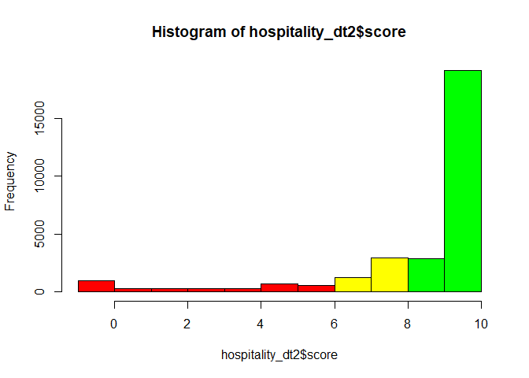
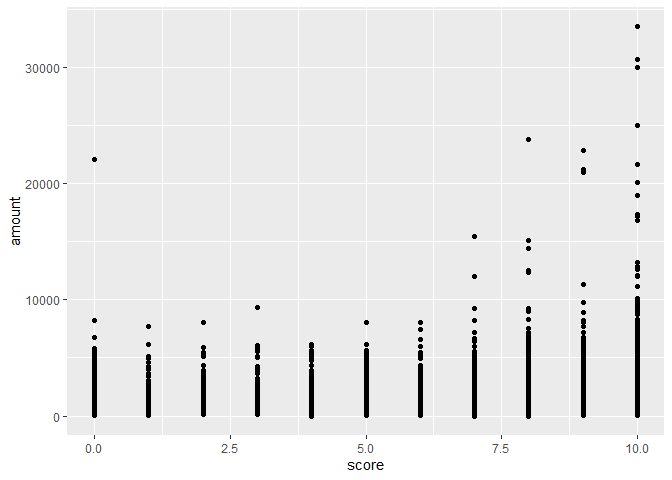

# R Programming: Customer Experience in R

## Example 


```r
# Importing the data.table
# ---
# 
library("data.table")
library(stats)
library(psych)
library(ggplot2)
```

```
## Warning: package 'ggplot2' was built under R version 3.6.1
```

```
## 
## Attaching package: 'ggplot2'
```

```
## The following objects are masked from 'package:psych':
## 
##     %+%, alpha
```

```r
# Reading our dataset
# ---
# 
hospitality_dt <- fread('http://bit.ly/HospitalityDataset')
View(hospitality_dt)
attach(hospitality_dt)
```


```r
# What is the structure of the data?
# ---
# 
head(hospitality_dt)
```

```
##    user_id gender timestamp survey_completion score amount          branch
## 1:  621602      M   11:58.1          TIMEDOUT     -   1320   Nairobi South
## 2:  242833      F   45:20.0          FINISHED     5   1460 Nairobi Central
## 3:  621602      M   00:36.0          TIMEDOUT     -   1270   Nairobi South
## 4:  621602      M   10:15.0          TIMEDOUT     -    700   Nairobi North
## 5: 6345755      M   54:58.1          TIMEDOUT     -    680   Nairobi North
## 6:  751525      M   35:52.7          TIMEDOUT     -    460    Nairobi West
```


```r
# How many variables and observations are there?
# 
ncol(hospitality_dt)
```

```
## [1] 7
```

```r
nrow(hospitality_dt)
```

```
## [1] 296852
```


```r
#learn more about the dataset
help(hospitality_dt)
```

```
## No documentation for 'hospitality_dt' in specified packages and libraries:
## you could try '??hospitality_dt'
```

```r
??hospitality_dt
```

```
## starting httpd help server ... done
```

```r
str(hospitality_dt)
```

```
## Classes 'data.table' and 'data.frame':	296852 obs. of  7 variables:
##  $ user_id          : int  621602 242833 621602 621602 6345755 751525 6591998 401557 17887026 1697459 ...
##  $ gender           : chr  "M" "F" "M" "M" ...
##  $ timestamp        : chr  "11:58.1" "45:20.0" "00:36.0" "10:15.0" ...
##  $ survey_completion: chr  "TIMEDOUT" "FINISHED" "TIMEDOUT" "TIMEDOUT" ...
##  $ score            : chr  "-" "5" "-" "-" ...
##  $ amount           : int  1320 1460 1270 700 680 460 570 1820 260 690 ...
##  $ branch           : chr  "Nairobi South" "Nairobi Central" "Nairobi South" "Nairobi North" ...
##  - attr(*, ".internal.selfref")=<externalptr>
```

```r
class(hospitality_dt)
```

```
## [1] "data.table" "data.frame"
```

```r
typeof(hospitality_dt) 
```

```
## [1] "list"
```

```r
length(hospitality_dt)
```

```
## [1] 7
```

```r
names(hospitality_dt) #display variable names
```

```
## [1] "user_id"           "gender"            "timestamp"        
## [4] "survey_completion" "score"             "amount"           
## [7] "branch"
```

```r
#attributes(hospitality_dt) #names(hospitality_dt), class(hospitality_dt), row.names(hospitality_dt)
```


```r
# What is the missing data?
# 
sum(is.na(hospitality_dt))
```

```
## [1] 0
```


```r
# NB: Let's deal with "-" in our scores variable
# Assumption is that those customers did not fill in the survey
# 
hospitality_dt$score[hospitality_dt$score == "-"] <- NA

head(hospitality_dt)
```

```
##    user_id gender timestamp survey_completion score amount          branch
## 1:  621602      M   11:58.1          TIMEDOUT  <NA>   1320   Nairobi South
## 2:  242833      F   45:20.0          FINISHED     5   1460 Nairobi Central
## 3:  621602      M   00:36.0          TIMEDOUT  <NA>   1270   Nairobi South
## 4:  621602      M   10:15.0          TIMEDOUT  <NA>    700   Nairobi North
## 5: 6345755      M   54:58.1          TIMEDOUT  <NA>    680   Nairobi North
## 6:  751525      M   35:52.7          TIMEDOUT  <NA>    460    Nairobi West
```


```r
# Getting rid of missing data, check size and preview
# Size of original dataset was 296852
# 
hospitality_dt1 <- na.omit(hospitality_dt)
nrow(hospitality_dt1)
```

```
## [1] 36402
```

```r
head(hospitality_dt1)
```

```
##     user_id gender timestamp survey_completion score amount
## 1:   242833      F   45:20.0          FINISHED     5   1460
## 2:  1697459      M   39:01.6          TIMEDOUT     9    690
## 3: 17144551      F   55:19.5          TIMEDOUT     0   1380
## 4: 17887216      F   00:38.1          TIMEDOUT     9    990
## 5:   630299      F   03:49.9          TIMEDOUT     9    840
## 6:   607011      M   20:46.1          TIMEDOUT    10    460
##             branch
## 1: Nairobi Central
## 2:    Nairobi East
## 3: Nairobi Central
## 4:   Nairobi South
## 5:    Nairobi West
## 6:   Nairobi South
```

```r
View(hospitality_dt1)
attach(hospitality_dt1)
```

```
## The following objects are masked from hospitality_dt:
## 
##     amount, branch, gender, score, survey_completion, timestamp,
##     user_id
```


```r
# What is the overall proportion of repeat customers?
#duplicated() function uses logical values to determine duplicated values.  

#duplicated(hospitality_dt1$user_id)

sum(duplicated(hospitality_dt1$user_id))
```

```
## [1] 6749
```

```r
dim(hospitality_dt1[duplicated(hospitality_dt1$user_id),])[1] #gives you number of duplicates
```

```
## [1] 6749
```

```r
table(duplicated(hospitality_dt1$user_id))
```

```
## 
## FALSE  TRUE 
## 29653  6749
```

```r
mean(duplicated(hospitality_dt1$user_id))
```

```
## [1] 0.1854019
```

```r
sum(duplicated(hospitality_dt1$user_id)) / nrow(hospitality_dt1)
```

```
## [1] 0.1854019
```


```r
# How many times do customers come back on average?


#unique() function uses numeric indicators to determine unique values.

library(plyr)

#unique(hospitality_dt1$user_id)

#count(unique(hospitality_dt1$user_id))

#table(unique(hospitality_dt1$user_id))

dim(hospitality_dt1[unique(hospitality_dt1$user_id),])[1] #gives you number of uniques
```

```
## [1] 29653
```


```r
# How many customers are repeat customers per branch?
#   
sum(duplicated(hospitality_dt1[,c('user_id','branch')]))
```

```
## [1] 4574
```


```r
# What is the NPS?
# 

# Importing our NPS library
# 
library(NPS)

# Converting score column to numeric
#
hospitality_dt1$score <- as.numeric(as.character(hospitality_dt1$score))

# Computing our NPS
nps(hospitality_dt1$score)
```

```
## [1] 0.6367782
```


```r
# Here are the proportions of respondents giving each Likelihood to
# recommend response
#
prop.table(table(hospitality_dt1$score))
```

```
## 
##           0           1           2           3           4           5 
## 0.031893852 0.009147849 0.009834624 0.009422559 0.010109335 0.023872315 
##           6           7           8           9          10 
## 0.018900060 0.041069172 0.095791440 0.098538542 0.651420252
```


```r
# Plotting a histrogram of the scores
# 

# Lets first import tidyverse
#
library(tidyverse)
```

```
## Warning: package 'tidyverse' was built under R version 3.6.1
```

```
## -- Attaching packages -------------------------------------------------------------------------- tidyverse 1.3.0 --
```

```
## v tibble  2.1.3     v dplyr   0.8.3
## v tidyr   1.0.0     v stringr 1.4.0
## v readr   1.3.1     v forcats 0.4.0
## v purrr   0.3.3
```

```
## Warning: package 'tibble' was built under R version 3.6.1
```

```
## Warning: package 'tidyr' was built under R version 3.6.1
```

```
## Warning: package 'purrr' was built under R version 3.6.1
```

```
## Warning: package 'dplyr' was built under R version 3.6.1
```

```
## -- Conflicts ----------------------------------------------------------------------------- tidyverse_conflicts() --
## x ggplot2::%+%()     masks psych::%+%()
## x ggplot2::alpha()   masks psych::alpha()
## x dplyr::arrange()   masks plyr::arrange()
## x dplyr::between()   masks data.table::between()
## x purrr::compact()   masks plyr::compact()
## x dplyr::count()     masks plyr::count()
## x dplyr::failwith()  masks plyr::failwith()
## x dplyr::filter()    masks stats::filter()
## x dplyr::first()     masks data.table::first()
## x dplyr::id()        masks plyr::id()
## x dplyr::lag()       masks stats::lag()
## x dplyr::last()      masks data.table::last()
## x dplyr::mutate()    masks plyr::mutate()
## x dplyr::rename()    masks plyr::rename()
## x dplyr::summarise() masks plyr::summarise()
## x dplyr::summarize() masks plyr::summarize()
## x purrr::transpose() masks data.table::transpose()
```

```r
hist(
  hospitality_dt1$score, breaks = -1:10,
  col = c(rep("red", 7), rep("yellow", 2), rep("green", 2))
)
```

<!-- -->


```r
# Here's a barplot. It's very similar, though for categorical responses
# it's often slightly easier to interpret
#
barplot(
 prop.table(table(hospitality_dt1$score)),
 col = c(rep("red", 7), rep("yellow", 2), rep("green", 2))
)
```

<!-- -->


```r
# Is there a relationship between NPS segment and amount spent? 
#  
ggplot(hospitality_dt1, aes(x=score, y=amount)) + geom_point()
```

<!-- -->

## Exercise


```r
#Build a model with unique id only 

hospitality_dt1[duplicated(hospitality_dt1$user_id),] #gives you duplicate rows
```

```
##        user_id gender timestamp survey_completion score amount
##    1: 17430789      F   28:02.5          FINISHED     9    570
##    2:   328437      F   17:03.2          FINISHED    10   1600
##    3:   668285      M   36:33.7          TIMEDOUT     9    170
##    4:   206998      F   32:55.0          FINISHED    10    950
##    5:   323566      M   08:43.0          TIMEDOUT     9    500
##   ---                                                         
## 6745:   444277      F   01:03.8          FINISHED    10    200
## 6746: 17158635      M   30:29.0          FINISHED    10    680
## 6747:  2246544      F   37:53.3          FINISHED    10    580
## 6748:  1147687      M   58:04.0          FINISHED     9    300
## 6749:   314116      M   58:53.3          FINISHED     9    200
##                branch
##    1: Nairobi Central
##    2:   Nairobi South
##    3:   Nairobi South
##    4:   Nairobi North
##    5: Nairobi Central
##   ---                
## 6745:   Nairobi North
## 6746:    Nairobi West
## 6747:    Nairobi East
## 6748:   Nairobi South
## 6749:   Nairobi North
```

```r
hospitality_dt1[!duplicated(hospitality_dt1$user_id),] #gives you unique rows
```

```
##         user_id gender timestamp survey_completion score amount
##     1:   242833      F   45:20.0          FINISHED     5   1460
##     2:  1697459      M   39:01.6          TIMEDOUT     9    690
##     3: 17144551      F   55:19.5          TIMEDOUT     0   1380
##     4: 17887216      F   00:38.1          TIMEDOUT     9    990
##     5:   630299      F   03:49.9          TIMEDOUT     9    840
##    ---                                                         
## 29649:   423355      M   00:28.5          FINISHED    10   1040
## 29650:  1235116      M   04:42.4          TIMEDOUT     8    580
## 29651: 18205871      M   40:54.7          FINISHED     3   1600
## 29652:   677307      F   25:32.0          FINISHED    10    570
## 29653:    97324      F   54:03.2          FINISHED    10    530
##                 branch
##     1: Nairobi Central
##     2:    Nairobi East
##     3: Nairobi Central
##     4:   Nairobi South
##     5:    Nairobi West
##    ---                
## 29649:       Satellite
## 29650:    Nairobi West
## 29651:   Nairobi South
## 29652:    Nairobi West
## 29653: Nairobi Central
```

```r
#Data with unique id only
hospitality_dt2 <- hospitality_dt1[!duplicated(hospitality_dt1$user_id),]
View(hospitality_dt2)
attach(hospitality_dt2)
```

```
## The following objects are masked from hospitality_dt1:
## 
##     amount, branch, gender, score, survey_completion, timestamp,
##     user_id
```

```
## The following objects are masked from hospitality_dt:
## 
##     amount, branch, gender, score, survey_completion, timestamp,
##     user_id
```

```r
nrow(hospitality_dt2)
```

```
## [1] 29653
```

```r
# Converting score column to numeric
hospitality_dt2$score <- as.numeric(as.character(hospitality_dt2$score))

# Computing our NPS
nps(hospitality_dt2$score)
```

```
## [1] 0.6227026
```

```r
# proportions of respondents giving each Likelihood to

prop.table(table(hospitality_dt2$score))
```

```
## 
##           0           1           2           3           4           5 
## 0.033824571 0.009476276 0.010251914 0.009712339 0.010218190 0.024550636 
##           6           7           8           9          10 
## 0.019627019 0.042963612 0.099011904 0.096516373 0.643847166
```

```r
#Histogram

hist(
  hospitality_dt2$score, breaks = -1:10,
  col = c(rep("red", 7), rep("yellow", 2), rep("green", 2))
)
```

<!-- -->

```r
#Barplot

barplot(
 prop.table(table(hospitality_dt2$score)),
 col = c(rep("red", 7), rep("yellow", 2), rep("green", 2))
)
```

<!-- -->

```r
ggplot(hospitality_dt2, aes(x=score, y=amount)) + geom_point()
```

<!-- -->


```r
# Can we build a logistic regression model to predict 
# whether a customer will be a repeat customer or not?
# 
```
