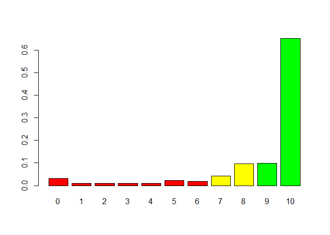
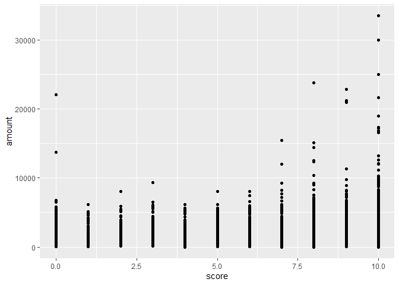
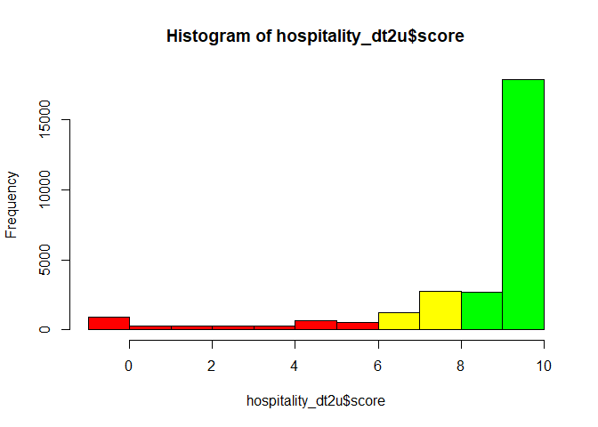
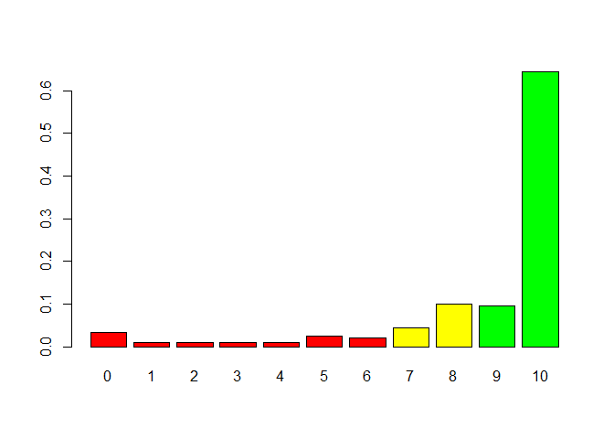
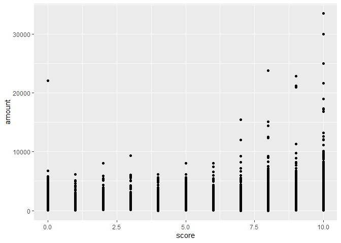

# R Programming

## Set Chunk requirements


```r
knitr::opts_chunk$set(echo = TRUE, message = FALSE, warning = FALSE)
#echo=FALSE indicates that the code will not be shown in the final document 
#(though any results/output would still be displayed).
#include=FALSE to have the chunk evaluated, but neither the code nor its output displayed
# warning=FALSE and message=FALSE suppress any R warnings or messages from being included 
#in the final document
```

## Example 


```r
# Importing the data.table
# ---
# 
library("data.table")
library(stats)
library(psych)
library(ggplot2)

# Reading our dataset
# ---
#fread accepts http and https URLs directly as well as operating system commands 
#such as sed and awk output.

hospitality_dt <- fread('http://bit.ly/HospitalityDataset')
View(hospitality_dt)
attach(hospitality_dt)
```


```r
# What is the structure of the data?
# ---
# 
head(hospitality_dt)
```

```
##    user_id gender timestamp survey_completion score amount          branch
## 1:  621602      M   11:58.1          TIMEDOUT     -   1320   Nairobi South
## 2:  242833      F   45:20.0          FINISHED     5   1460 Nairobi Central
## 3:  621602      M   00:36.0          TIMEDOUT     -   1270   Nairobi South
## 4:  621602      M   10:15.0          TIMEDOUT     -    700   Nairobi North
## 5: 6345755      M   54:58.1          TIMEDOUT     -    680   Nairobi North
## 6:  751525      M   35:52.7          TIMEDOUT     -    460    Nairobi West
```


```r
# How many variables and observations are there?
# 
ncol(hospitality_dt)
```

```
## [1] 7
```

```r
nrow(hospitality_dt)
```

```
## [1] 277300
```


```r
#learn more about the dataset
help(hospitality_dt)
```

```
## No documentation for 'hospitality_dt' in specified packages and libraries:
## you could try '??hospitality_dt'
```

```r
??hospitality_dt
str(hospitality_dt)
```

```
## Classes 'data.table' and 'data.frame':	277300 obs. of  7 variables:
##  $ user_id          : int  621602 242833 621602 621602 6345755 751525 6591998 401557 17887026 1697459 ...
##  $ gender           : chr  "M" "F" "M" "M" ...
##  $ timestamp        : chr  "11:58.1" "45:20.0" "00:36.0" "10:15.0" ...
##  $ survey_completion: chr  "TIMEDOUT" "FINISHED" "TIMEDOUT" "TIMEDOUT" ...
##  $ score            : chr  "-" "5" "-" "-" ...
##  $ amount           : int  1320 1460 1270 700 680 460 570 1820 260 690 ...
##  $ branch           : chr  "Nairobi South" "Nairobi Central" "Nairobi South" "Nairobi North" ...
##  - attr(*, ".internal.selfref")=<externalptr>
```

```r
class(hospitality_dt)
```

```
## [1] "data.table" "data.frame"
```

```r
typeof(hospitality_dt) 
```

```
## [1] "list"
```

```r
length(hospitality_dt)
```

```
## [1] 7
```

```r
names(hospitality_dt) #display variable names
```

```
## [1] "user_id"           "gender"            "timestamp"        
## [4] "survey_completion" "score"             "amount"           
## [7] "branch"
```

```r
#attributes(hospitality_dt) #names(hospitality_dt), class(hospitality_dt), row.names(hospitality_dt)
```


```r
summary(hospitality_dt)
```

```
##     user_id            gender           timestamp         survey_completion 
##  Min.   :   61052   Length:277300      Length:277300      Length:277300     
##  1st Qu.:  374487   Class :character   Class :character   Class :character  
##  Median :  685597   Mode  :character   Mode  :character   Mode  :character  
##  Mean   : 2914443                                                           
##  3rd Qu.: 1249912                                                           
##  Max.   :18234387                                                           
##     score               amount         branch         
##  Length:277300      Min.   :    1   Length:277300     
##  Class :character   1st Qu.:  420   Class :character  
##  Mode  :character   Median :  770   Mode  :character  
##                     Mean   : 1080                     
##                     3rd Qu.: 1360                     
##                     Max.   :66250
```

```r
#distribution of input variables
table(hospitality_dt$gender)
```

```
## 
##      F      M 
## 135326 141974
```

```r
table(hospitality_dt$score)
```

```
## 
##      -      0      1     10      2      3      4      5      6      7      8 
## 243721   1060    305  21856    331    309    344    799    636   1398   3241 
##      9 
##   3300
```

```r
table(hospitality_dt$branch)
```

```
## 
##            #N/A          Nairob Nairobi Central    Nairobi East   Nairobi North 
##               1               1           50211           18896           54164 
##   Nairobi South    Nairobi West       Satellite 
##           43097           74396           36534
```


```r
# What is the missing data?
# 
sum(is.na(hospitality_dt))
```

```
## [1] 0
```


```r
# NB: Let's deal with "-" in our scores variable
# Assumption is that those customers did not fill in the survey
# 
hospitality_dt$score[hospitality_dt$score == "-"] <- NA

head(hospitality_dt)
```

```
##    user_id gender timestamp survey_completion score amount          branch
## 1:  621602      M   11:58.1          TIMEDOUT  <NA>   1320   Nairobi South
## 2:  242833      F   45:20.0          FINISHED     5   1460 Nairobi Central
## 3:  621602      M   00:36.0          TIMEDOUT  <NA>   1270   Nairobi South
## 4:  621602      M   10:15.0          TIMEDOUT  <NA>    700   Nairobi North
## 5: 6345755      M   54:58.1          TIMEDOUT  <NA>    680   Nairobi North
## 6:  751525      M   35:52.7          TIMEDOUT  <NA>    460    Nairobi West
```


```r
# Getting rid of missing data, check size and preview
# Size of original dataset was 296852
# 
hospitality_dt1 <- na.omit(hospitality_dt)
nrow(hospitality_dt1)
```

```
## [1] 33579
```

```r
head(hospitality_dt1)
```

```
##     user_id gender timestamp survey_completion score amount          branch
## 1:   242833      F   45:20.0          FINISHED     5   1460 Nairobi Central
## 2:  1697459      M   39:01.6          TIMEDOUT     9    690    Nairobi East
## 3: 17144551      F   55:19.5          TIMEDOUT     0   1380 Nairobi Central
## 4: 17887216      F   00:38.1          TIMEDOUT     9    990   Nairobi South
## 5:   630299      F   03:49.9          TIMEDOUT     9    840    Nairobi West
## 6:   607011      M   20:46.1          TIMEDOUT    10    460   Nairobi South
```

```r
View(hospitality_dt1)
attach(hospitality_dt1)


str(hospitality_dt1)
```

```
## Classes 'data.table' and 'data.frame':	33579 obs. of  7 variables:
##  $ user_id          : int  242833 1697459 17144551 17887216 630299 607011 17249001 6345132 17237328 17887747 ...
##  $ gender           : chr  "F" "M" "F" "F" ...
##  $ timestamp        : chr  "45:20.0" "39:01.6" "55:19.5" "00:38.1" ...
##  $ survey_completion: chr  "FINISHED" "TIMEDOUT" "TIMEDOUT" "TIMEDOUT" ...
##  $ score            : chr  "5" "9" "0" "9" ...
##  $ amount           : int  1460 690 1380 990 840 460 1200 2230 1080 1110 ...
##  $ branch           : chr  "Nairobi Central" "Nairobi East" "Nairobi Central" "Nairobi South" ...
##  - attr(*, ".internal.selfref")=<externalptr>
```

```r
class(hospitality_dt1)
```

```
## [1] "data.table" "data.frame"
```

```r
typeof(hospitality_dt1) 
```

```
## [1] "list"
```

```r
length(hospitality_dt1)
```

```
## [1] 7
```

```r
names(hospitality_dt1) #display variable names
```

```
## [1] "user_id"           "gender"            "timestamp"        
## [4] "survey_completion" "score"             "amount"           
## [7] "branch"
```

```r
summary(hospitality_dt1)
```

```
##     user_id            gender           timestamp         survey_completion 
##  Min.   :   61052   Length:33579       Length:33579       Length:33579      
##  1st Qu.:  475292   Class :character   Class :character   Class :character  
##  Median :  940942   Mode  :character   Mode  :character   Mode  :character  
##  Mean   : 4339395                                                           
##  3rd Qu.: 2602796                                                           
##  Max.   :18234387                                                           
##     score               amount         branch         
##  Length:33579       Min.   :    1   Length:33579      
##  Class :character   1st Qu.:  440   Class :character  
##  Mode  :character   Median :  800   Mode  :character  
##                     Mean   : 1125                     
##                     3rd Qu.: 1420                     
##                     Max.   :33520
```

```r
#distribution of input variables
table(hospitality_dt1$gender)
```

```
## 
##     F     M 
## 16713 16866
```

```r
table(hospitality_dt1$score)
```

```
## 
##     0     1    10     2     3     4     5     6     7     8     9 
##  1060   305 21856   331   309   344   799   636  1398  3241  3300
```

```r
table(hospitality_dt1$amount)
```

```
## 
##     1     2     5    10    20    30    40    50    60    70    80    85    90 
##    10     1     1     5     4     3    11     8     7     5     6     1     9 
##    95    99   100   110   120   130   136   140   150   152   160   162   168 
##     1     1    58    12     9     6     1     9    28     3   102     3     1 
##   170   175   176   180   184   185   190   192   200   202   208   210   211 
##   555     1    28   104     3     6    67     6   639     1     7    62     1 
##   215   216   220   230   234   240   250   256   258   260   264   265   270 
##     1     3  1200   320     2   144   246     2     1   264     1     2   515 
##   280   290   293   296   300   304   305   308   310   315   320   330   336 
##    65   272     1     8   325     1     2     1   192     1   110   133     8 
##   337   340   347   349   350   352   356   360   367   368   370   375   377 
##     2   204     1     1   162    11     1   132     1     3   531     1     1 
##   380   384   385   390   391   392   393   395   400   405   406   408   410 
##   126     5     6   291     1     1     1     3   592     2     1     1    84 
##   416   420   422   424   425   430   432   440   448   450   460   465   470 
##     1   449     1     2     1   160     1   704     1   221   252     1   433 
##   472   480   490   493   498   500   510   512   515   520   525   527   528 
##     1   309   220     1     1   367   125     1     1   246     1     1     1 
##   530   534   540   544   550   552   555   560   568   570   576   580   590 
##   224     1   251     1   179     2     4   178     2   180     2   184   169 
##   592   600   604   605   608   610   615   616   620   624   625   630   640 
##     1   315     1     4     1   134     1     1   198     2     2   154   263 
##   650   656   660   663   664   666   670   672   680   688   690   696   700 
##   136     1   239     2     1     1   153     3   160     2   281     3   264 
##   702   704   707   710   720   725   728   730   735   736   740   750   752 
##     1     2     1   157   161     1     1   188     1     2   312   209     2 
##   755   760   765   768   770   780   790   792   800   808   809   810   820 
##     1   128     1     1   146   224   108     2   291     1     1   125   142 
##   828   830   832   840   847   850   853   860   864   870   872   880   886 
##     1   118     1   232     1   123     1   186     1   120     4   279     1 
##   890   900   904   905   910   920   928   930   932   940   945   948   950 
##   235   172     1     1   156   250     2   153     1   201     1     1   179 
##   952   960   965   970   975   980   985   987   990   996  1000  1006  1008 
##     1   166     1   122     1   150     1     1   159     1   318     1     2 
##  1010  1020  1021  1030  1035  1040  1047  1050  1053  1060  1065  1070  1080 
##   108   118     1   105     1   159     1   129     2   144     1   109   151 
##  1090  1097  1100  1104  1110  1112  1120  1128  1130  1135  1136  1140  1150 
##   169     1   147     1   124     1   111     2   101     1     2   142   149 
##  1155  1160  1170  1175  1180  1185  1190  1200  1204  1208  1210  1215  1220 
##     1   126    94     1   174     1   102   164     1     1   112     1   114 
##  1230  1240  1244  1250  1255  1256  1260  1270  1280  1285  1290  1295  1296 
##    86    88     1    87     1     1   102    98    96     1    95     1     1 
##  1300  1310  1320  1330  1340  1350  1360  1364  1370  1378  1380  1385  1390 
##   113    86   118    79    92    94    77     1    71     1    86     1    87 
##  1400  1405  1410  1420  1430  1435  1440  1450  1460  1470  1480  1485  1490 
##    86     1    76    81    65     1    87    54    70    67    80     1    53 
##  1500  1510  1520  1530  1540  1550  1560  1565  1570  1575  1580  1584  1590 
##   112    60    61    55    76    58    69     1    58     1    47     1    47 
##  1594  1600  1610  1620  1630  1640  1645  1650  1659  1660  1670  1680  1690 
##     1    73    48    56    56    58     1    50     1    72    51    53    42 
##  1700  1705  1706  1710  1712  1720  1730  1740  1750  1751  1760  1770  1780 
##    66     1     1    54     1    58    52    51    56     1    58    44    53 
##  1790  1800  1810  1820  1826  1830  1836  1840  1850  1860  1870  1880  1890 
##    44    61    57    50     1    42     1    55    42    56    47    44    35 
##  1900  1910  1920  1930  1940  1950  1960  1970  1980  1984  1990  2000  2010 
##    63    48    57    28    50    48    50    31    61     1    29   116    42 
##  2020  2030  2040  2050  2060  2064  2070  2080  2082  2090  2100  2110  2112 
##    41    43    51    31    33     1    41    43     1    50    37    36     1 
##  2120  2130  2140  2150  2160  2170  2180  2190  2200  2210  2220  2230  2240 
##    39    36    46    36    42    54    58    46    53    37    37    42    43 
##  2248  2250  2260  2270  2272  2280  2290  2300  2305  2310  2320  2330  2340 
##     1    34    48    27     1    47    41    53     1    42    49    39    49 
##  2346  2350  2360  2370  2380  2390  2400  2410  2420  2424  2430  2440  2450 
##     1    40    46    36    44    25    47    38    36     1    40    46    34 
##  2460  2470  2480  2490  2500  2510  2520  2530  2540  2550  2560  2570  2580 
##    50    44    31    28    54    26    43    26    26    26    33    38    42 
##  2590  2592  2600  2610  2620  2630  2632  2640  2649  2650  2660  2670  2680 
##    18     1    33    42    27    23     1    42     1    22    36    29    37 
##  2690  2700  2710  2720  2727  2730  2740  2750  2760  2770  2780  2790  2800 
##    21    28    23    20     1    18    23    23    28    27    22    26    28 
##  2810  2820  2824  2830  2840  2850  2860  2870  2880  2890  2900  2910  2920 
##    20    18     1    20    22    17    18    14    27    18    20    19    16 
##  2930  2940  2950  2960  2970  2980  2990  3000  3010  3020  3030  3035  3040 
##    15    19    16    15    14    19    20    42     8    13    16     1    12 
##  3050  3060  3070  3080  3090  3100  3110  3120  3130  3140  3150  3160  3170 
##    14    11    18    10    14     6    13    13    12    12    22    10     9 
##  3180  3190  3200  3210  3220  3230  3240  3250  3260  3270  3280  3290  3300 
##     8    11    24    14    16     8    12    15    10     8    13    13    15 
##  3310  3320  3330  3340  3350  3360  3370  3376  3380  3390  3400  3410  3420 
##     8    10     7    11     8     8    13     1    13    11    11     7     7 
##  3430  3440  3450  3460  3470  3480  3490  3500  3510  3520  3530  3540  3550 
##     6    11     8     6    11     8    13    15     3     8     6    10     7 
##  3560  3570  3580  3590  3600  3610  3620  3630  3640  3650  3660  3670  3680 
##     9     8    14     8    45     4     7     6     5     5    16     9     8 
##  3690  3700  3710  3720  3730  3740  3750  3760  3770  3780  3790  3800  3810 
##     5    26     4    11     7     7     7     5     6     7     5     8    12 
##  3820  3830  3840  3848  3850  3860  3870  3880  3890  3900  3910  3920  3930 
##     3     9     9     1     3     5     6     8     8     9    11     8     7 
##  3940  3950  3960  3970  3980  3990  3999  4000  4010  4020  4030  4040  4050 
##     7     2     8     8     6     8     1    19     5     4     4     5     3 
##  4060  4070  4080  4090  4100  4110  4120  4130  4140  4150  4160  4170  4180 
##     8     8     4     5     3     5     5     5     8     1     5    10     3 
##  4190  4200  4210  4220  4230  4240  4250  4260  4270  4280  4290  4300  4310 
##    10     8     8     4     4     4     8     6     6     7     1     7     1 
##  4320  4330  4340  4350  4360  4370  4380  4400  4410  4420  4430  4440  4450 
##     2     3     4     3     4     4     3     3     1     6     2     4     6 
##  4460  4462  4470  4480  4490  4500  4510  4520  4530  4540  4560  4570  4580 
##     4     1     1     2     5     5     3     1     3     3     1     3     3 
##  4590  4600  4610  4620  4630  4650  4660  4670  4680  4690  4700  4710  4720 
##     1     1     3     2     2     1     6     1     1     2     5     2     7 
##  4730  4740  4750  4760  4770  4780  4790  4800  4810  4820  4830  4840  4850 
##     2     3     1     1     2     1     2     5     3     2     1     5     3 
##  4860  4870  4880  4890  4900  4910  4920  4930  4940  4950  4960  4972  4980 
##     4     4     3     2     2     4     3     2     4     1     2     1     1 
##  4990  5000  5010  5020  5030  5040  5050  5060  5070  5080  5090  5100  5110 
##     4    12     4     1     3     2     2     2     2     3     2     1     2 
##  5120  5130  5140  5150  5160  5170  5180  5190  5200  5210  5220  5230  5240 
##     2     3     1     2     3     4     2     1     1     1     2     1     3 
##  5250  5260  5280  5290  5300  5310  5320  5330  5340  5350  5360  5370  5380 
##     2     1     1     4     2     3     2     1     4     4     2     1     3 
##  5390  5400  5410  5420  5430  5440  5450  5460  5480  5490  5500  5510  5520 
##     2     3     1     1     4     4     3     1     4     2     4     2     1 
##  5530  5540  5550  5560  5570  5580  5590  5600  5610  5620  5630  5640  5650 
##     2     3     2     1     3     3     2     1     2     2     1     2     2 
##  5660  5670  5680  5690  5710  5730  5740  5750  5760  5780  5800  5810  5820 
##     4     1     3     2     3     1     2     2     3     1     2     3     1 
##  5830  5880  5890  5900  5920  5940  5950  5960  5980  6000  6010  6020  6030 
##     3     1     1     2     1     1     1     3     1     5     1     1     1 
##  6070  6090  6100  6120  6130  6140  6150  6160  6170  6180  6190  6200  6230 
##     1     1     3     2     1     2     1     2     1     1     1     1     3 
##  6240  6280  6300  6310  6320  6340  6370  6380  6390  6400  6410  6420  6430 
##     1     1     1     1     1     1     1     1     1     2     1     2     1 
##  6440  6450  6460  6480  6490  6500  6520  6540  6550  6560  6570  6580  6590 
##     1     1     2     3     1     2     2     2     1     1     2     1     1 
##  6600  6620  6630  6690  6700  6710  6720  6740  6780  6790  6900  6930  6950 
##     1     1     1     1     3     3     2     2     1     1     1     2     1 
##  7000  7060  7070  7090  7128  7140  7150  7170  7180  7190  7200  7230  7350 
##     1     1     1     1     1     1     2     1     1     1     1     1     1 
##  7410  7450  7460  7470  7510  7520  7600  7630  7730  7740  7770  7780  7970 
##     1     1     1     1     1     1     1     1     1     1     1     1     1 
##  8000  8020  8030  8090  8140  8210  8230  8250  8260  8280  8290  8300  8330 
##     2     1     1     4     1     1     1     1     1     1     2     1     1 
##  8720  8740  8780  8800  8830  8890  9020  9040  9210  9220  9250  9270  9279 
##     1     1     1     1     1     1     1     1     1     1     2     1     1 
##  9350  9370  9400  9440  9600  9655  9720  9780  9800 10000 10130 10150 10270 
##     1     1     1     1     1     1     1     1     1     2     1     1     1 
## 10410 11150 11360 12000 12100 12330 12540 12580 13230 13770 14410 15080 15440 
##     1     1     1     2     1     1     1     1     1     1     1     1     1 
## 16575 16820 17160 17380 18960 20970 21220 21640 22130 22900 23820 25000 30000 
##     1     1     1     1     1     1     1     1     1     1     1     1     1 
## 33520 
##     1
```

```r
table(hospitality_dt1$branch)
```

```
## 
##            #N/A          Nairob Nairobi Central    Nairobi East   Nairobi North 
##               1               1            5900            2535            6131 
##   Nairobi South    Nairobi West       Satellite 
##            5292            8094            5625
```


```r
# What is the overall proportion of repeat customers?
#duplicated() function uses logical values to determine duplicated values.  

#duplicated(hospitality_dt1$user_id)

sum(duplicated(hospitality_dt1$user_id))
```

```
## [1] 5918
```

```r
dim(hospitality_dt1[duplicated(hospitality_dt1$user_id),])[1] #gives you number of duplicates
```

```
## [1] 5918
```

```r
table(duplicated(hospitality_dt1$user_id))
```

```
## 
## FALSE  TRUE 
## 27661  5918
```

```r
mean(duplicated(hospitality_dt1$user_id))
```

```
## [1] 0.1762411
```

```r
sum(duplicated(hospitality_dt1$user_id)) / nrow(hospitality_dt1)
```

```
## [1] 0.1762411
```


```r
# How many times do customers come back on average?


#unique() function uses numeric indicators to determine unique values.

library(plyr)

#unique(hospitality_dt1$user_id)

#count(unique(hospitality_dt1$user_id))

#table(unique(hospitality_dt1$user_id))

dim(hospitality_dt1[unique(hospitality_dt1$user_id),])[1] #gives you number of uniques
```

```
## [1] 27661
```


```r
# How many customers are repeat customers per branch?
#   
sum(duplicated(hospitality_dt1[,c('user_id','branch')]))
```

```
## [1] 4004
```


```r
# What is the NPS?
# 

# Importing our NPS library
# 
library(NPS)

# Converting score column to numeric
#
hospitality_dt1$score <- as.numeric(as.character(hospitality_dt1$score))

# Computing our NPS
nps(hospitality_dt1$score)
```

```
## [1] 0.6364692
```


```r
# Here are the proportions of respondents giving each Likelihood to
# recommend response
#
prop.table(table(hospitality_dt1$score))
```

```
## 
##           0           1           2           3           4           5 
## 0.031567349 0.009083058 0.009857351 0.009202180 0.010244498 0.023794634 
##           6           7           8           9          10 
## 0.018940409 0.041633164 0.096518657 0.098275708 0.650882992
```


```r
# Plotting a histrogram of the scores
# 

# Lets first import tidyverse
#
library(tidyverse)

hist(
  hospitality_dt1$score, breaks = -1:10,
  col = c(rep("red", 7), rep("yellow", 2), rep("green", 2))
)
```

<!-- -->


```r
# Here's a barplot. It's very similar, though for categorical responses
# it's often slightly easier to interpret
#
barplot(
 prop.table(table(hospitality_dt1$score)),
 col = c(rep("red", 7), rep("yellow", 2), rep("green", 2))
)
```

<!-- -->


```r
# Is there a relationship between NPS segment and amount spent? 
#  
ggplot(hospitality_dt1, aes(x=score, y=amount)) + geom_point()
```

<!-- -->

## Exercise


```r
#Build a data model with unique id only 


hospitality_dt1[!duplicated(hospitality_dt1$user_id),] #gives you unique rows
```

```
##         user_id gender timestamp survey_completion score amount          branch
##     1:   242833      F   45:20.0          FINISHED     5   1460 Nairobi Central
##     2:  1697459      M   39:01.6          TIMEDOUT     9    690    Nairobi East
##     3: 17144551      F   55:19.5          TIMEDOUT     0   1380 Nairobi Central
##     4: 17887216      F   00:38.1          TIMEDOUT     9    990   Nairobi South
##     5:   630299      F   03:49.9          TIMEDOUT     9    840    Nairobi West
##    ---                                                                         
## 27657:  1137104      F   10:29.4          TIMEDOUT    10    740    Nairobi West
## 27658:  1372301      F   12:01.7          FINISHED     0    380   Nairobi North
## 27659:   341753      F   16:04.8          FINISHED     6    440    Nairobi West
## 27660:   911379      M   19:11.8          FINISHED    10    400   Nairobi South
## 27661:  1254905      F   22:41.0          TIMEDOUT     9   2830          Nairob
```

```r
#Data with unique id only
hospitality_dt2u <- hospitality_dt1[!duplicated(hospitality_dt1$user_id),]
View(hospitality_dt2u)
attach(hospitality_dt2u)

nrow(hospitality_dt2u)
```

```
## [1] 27661
```

```r
mean(hospitality_dt2u$amount)
```

```
## [1] 1139.493
```

```r
# Converting score column to numeric
hospitality_dt2u$score <- as.numeric(as.character(hospitality_dt2u$score))

# Computing our NPS
nps(hospitality_dt2u$score)
```

```
## [1] 0.6237302
```

```r
# proportions of respondents giving each Likelihood to

prop.table(table(hospitality_dt2u$score))
```

```
## 
##           0           1           2           3           4           5 
## 0.033440584 0.009435668 0.010158707 0.009507972 0.010339467 0.024402588 
##           6           7           8           9          10 
## 0.019630527 0.043237772 0.099201041 0.096381187 0.644264488
```

```r
#Histogram

hist(
  hospitality_dt2u$score, breaks = -1:10,
  col = c(rep("red", 7), rep("yellow", 2), rep("green", 2))
)
```

<!-- -->

```r
#Barplot

barplot(
 prop.table(table(hospitality_dt2u$score)),
 col = c(rep("red", 7), rep("yellow", 2), rep("green", 2))
)
```

<!-- -->

```r
ggplot(hospitality_dt2u, aes(x=score, y=amount)) + geom_point()
```

<!-- -->


```r
#For the unique userID data: separate the genders, find the average amount spent, find average NPS
hospitality_dt2uF <- hospitality_dt2u[hospitality_dt2u$gender == "F"]
View(hospitality_dt2uF)
attach(hospitality_dt2uF)

head(hospitality_dt2uF)
```

```
##     user_id gender timestamp survey_completion score amount          branch
## 1:   242833      F   45:20.0          FINISHED     5   1460 Nairobi Central
## 2: 17144551      F   55:19.5          TIMEDOUT     0   1380 Nairobi Central
## 3: 17887216      F   00:38.1          TIMEDOUT     9    990   Nairobi South
## 4:   630299      F   03:49.9          TIMEDOUT     9    840    Nairobi West
## 5:  6345132      F   42:13.1          TIMEDOUT    10   2230       Satellite
## 6: 17237328      F   59:23.9          TIMEDOUT     9   1080    Nairobi West
```

```r
nrow(hospitality_dt2uF)
```

```
## [1] 13922
```

```r
mean(hospitality_dt2uF$amount)
```

```
## [1] 1149.068
```

```r
# Converting score column to numeric
#
hospitality_dt2uF$score <- as.numeric(as.character(hospitality_dt2uF$score))

# Computing our NPS
nps(hospitality_dt2uF$score)
```

```
## [1] 0.6037207
```

```r
prop.table(table(hospitality_dt2uF$score))
```

```
## 
##          0          1          2          3          4          5          6 
## 0.03778193 0.01091797 0.01206723 0.01077431 0.01192357 0.02664847 0.02018388 
##          7          8          9         10 
## 0.04087056 0.09481396 0.09610688 0.63791122
```

```r
hospitality_dt2uM <- hospitality_dt2u[hospitality_dt2u$gender == "M"]
View(hospitality_dt2uM)
attach(hospitality_dt2uM)

head(hospitality_dt2uM)
```

```
##     user_id gender timestamp survey_completion score amount        branch
## 1:  1697459      M   39:01.6          TIMEDOUT     9    690  Nairobi East
## 2:   607011      M   20:46.1          TIMEDOUT    10    460 Nairobi South
## 3: 17249001      M   35:08.6          TIMEDOUT     7   1200 Nairobi South
## 4:   703633      M   07:30.7          TIMEDOUT    10    360     Satellite
## 5:   668285      M   24:28.9          TIMEDOUT     7    590 Nairobi North
## 6: 17355338      M   49:13.1          TIMEDOUT    10    420 Nairobi South
```

```r
nrow(hospitality_dt2uM)
```

```
## [1] 13739
```

```r
mean(hospitality_dt2uM$amount)
```

```
## [1] 1129.79
```

```r
# Converting score column to numeric
#
hospitality_dt2uM$score <- as.numeric(as.character(hospitality_dt2uM$score))

# Computing our NPS
nps(hospitality_dt2uM$score)
```

```
## [1] 0.6440061
```

```r
prop.table(table(hospitality_dt2uM$score))
```

```
## 
##           0           1           2           3           4           5 
## 0.029041415 0.007933620 0.008224762 0.008224762 0.008734260 0.022126792 
##           6           7           8           9          10 
## 0.019069801 0.045636509 0.103646554 0.096659145 0.650702380
```


```r
#Add a column with the word 'repeat' for repeated user ID and 'non-repeat' for unique user ID

#Data with repeated id only

hospitality_dt1[duplicated(hospitality_dt1$user_id),] #gives you duplicate rows
```

```
##        user_id gender timestamp survey_completion score amount          branch
##    1: 17430789      F   28:02.5          FINISHED     9    570 Nairobi Central
##    2:   328437      F   17:03.2          FINISHED    10   1600   Nairobi South
##    3:   668285      M   36:33.7          TIMEDOUT     9    170   Nairobi South
##    4:   206998      F   32:55.0          FINISHED    10    950   Nairobi North
##    5:   323566      M   08:43.0          TIMEDOUT     9    500 Nairobi Central
##   ---                                                                         
## 5914:   320780      M   41:35.4          FINISHED    10   2580    Nairobi East
## 5915:  2173231      F   49:40.7          FINISHED     0    200       Satellite
## 5916:  1010039      M   54:17.0          FINISHED    10    440    Nairobi West
## 5917:   740379      M   11:00.6          FINISHED    10    840 Nairobi Central
## 5918:   580624      M   12:46.6          FINISHED    10   1010       Satellite
```

```r
hospitality_dt2r <- hospitality_dt1[duplicated(hospitality_dt1$user_id),]
View(hospitality_dt2r)
attach(hospitality_dt2r)

nrow(hospitality_dt2r)
```

```
## [1] 5918
```

```r
#Whatever is on the left of the <- sign “gets” whatever is on the right

hospitality_dt2r$repeat_customer<-"repeat"
hospitality_dt2u$repeat_customer<-"non-repeat"


#To join two data frames (datasets) vertically
hospitality_dt1new <- rbind(hospitality_dt2r, hospitality_dt2u)
View(hospitality_dt1new)
attach(hospitality_dt1new)

head(hospitality_dt1new)
```

```
##     user_id gender timestamp survey_completion score amount          branch
## 1: 17430789      F   28:02.5          FINISHED     9    570 Nairobi Central
## 2:   328437      F   17:03.2          FINISHED    10   1600   Nairobi South
## 3:   668285      M   36:33.7          TIMEDOUT     9    170   Nairobi South
## 4:   206998      F   32:55.0          FINISHED    10    950   Nairobi North
## 5:   323566      M   08:43.0          TIMEDOUT     9    500 Nairobi Central
## 6:  1317686      M   13:35.8          TIMEDOUT    10   1420   Nairobi South
##    repeat_customer
## 1:          repeat
## 2:          repeat
## 3:          repeat
## 4:          repeat
## 5:          repeat
## 6:          repeat
```

```r
nrow(hospitality_dt1new)
```

```
## [1] 33579
```

```r
str(hospitality_dt1new)
```

```
## Classes 'data.table' and 'data.frame':	33579 obs. of  8 variables:
##  $ user_id          : int  17430789 328437 668285 206998 323566 1317686 317437 624684 336668 390899 ...
##  $ gender           : chr  "F" "F" "M" "F" ...
##  $ timestamp        : chr  "28:02.5" "17:03.2" "36:33.7" "32:55.0" ...
##  $ survey_completion: chr  "FINISHED" "FINISHED" "TIMEDOUT" "FINISHED" ...
##  $ score            : num  9 10 9 10 9 10 10 5 9 10 ...
##  $ amount           : int  570 1600 170 950 500 1420 190 780 1100 990 ...
##  $ branch           : chr  "Nairobi Central" "Nairobi South" "Nairobi South" "Nairobi North" ...
##  $ repeat_customer  : chr  "repeat" "repeat" "repeat" "repeat" ...
##  - attr(*, ".internal.selfref")=<externalptr>
```

```r
class(hospitality_dt1new)
```

```
## [1] "data.table" "data.frame"
```

```r
typeof(hospitality_dt1new) 
```

```
## [1] "list"
```

```r
length(hospitality_dt1new)
```

```
## [1] 8
```

```r
names(hospitality_dt1new) #display variable names
```

```
## [1] "user_id"           "gender"            "timestamp"        
## [4] "survey_completion" "score"             "amount"           
## [7] "branch"            "repeat_customer"
```

```r
summary(hospitality_dt1new)
```

```
##     user_id            gender           timestamp         survey_completion 
##  Min.   :   61052   Length:33579       Length:33579       Length:33579      
##  1st Qu.:  475292   Class :character   Class :character   Class :character  
##  Median :  940942   Mode  :character   Mode  :character   Mode  :character  
##  Mean   : 4339395                                                           
##  3rd Qu.: 2602796                                                           
##  Max.   :18234387                                                           
##      score            amount         branch          repeat_customer   
##  Min.   : 0.000   Min.   :    1   Length:33579       Length:33579      
##  1st Qu.: 8.000   1st Qu.:  440   Class :character   Class :character  
##  Median :10.000   Median :  800   Mode  :character   Mode  :character  
##  Mean   : 8.787   Mean   : 1125                                        
##  3rd Qu.:10.000   3rd Qu.: 1420                                        
##  Max.   :10.000   Max.   :33520
```

```r
#distribution of input variables
table(hospitality_dt1new$gender)
```

```
## 
##     F     M 
## 16713 16866
```

```r
table(hospitality_dt1new$score)
```

```
## 
##     0     1     2     3     4     5     6     7     8     9    10 
##  1060   305   331   309   344   799   636  1398  3241  3300 21856
```

```r
table(hospitality_dt1new$amount)
```

```
## 
##     1     2     5    10    20    30    40    50    60    70    80    85    90 
##    10     1     1     5     4     3    11     8     7     5     6     1     9 
##    95    99   100   110   120   130   136   140   150   152   160   162   168 
##     1     1    58    12     9     6     1     9    28     3   102     3     1 
##   170   175   176   180   184   185   190   192   200   202   208   210   211 
##   555     1    28   104     3     6    67     6   639     1     7    62     1 
##   215   216   220   230   234   240   250   256   258   260   264   265   270 
##     1     3  1200   320     2   144   246     2     1   264     1     2   515 
##   280   290   293   296   300   304   305   308   310   315   320   330   336 
##    65   272     1     8   325     1     2     1   192     1   110   133     8 
##   337   340   347   349   350   352   356   360   367   368   370   375   377 
##     2   204     1     1   162    11     1   132     1     3   531     1     1 
##   380   384   385   390   391   392   393   395   400   405   406   408   410 
##   126     5     6   291     1     1     1     3   592     2     1     1    84 
##   416   420   422   424   425   430   432   440   448   450   460   465   470 
##     1   449     1     2     1   160     1   704     1   221   252     1   433 
##   472   480   490   493   498   500   510   512   515   520   525   527   528 
##     1   309   220     1     1   367   125     1     1   246     1     1     1 
##   530   534   540   544   550   552   555   560   568   570   576   580   590 
##   224     1   251     1   179     2     4   178     2   180     2   184   169 
##   592   600   604   605   608   610   615   616   620   624   625   630   640 
##     1   315     1     4     1   134     1     1   198     2     2   154   263 
##   650   656   660   663   664   666   670   672   680   688   690   696   700 
##   136     1   239     2     1     1   153     3   160     2   281     3   264 
##   702   704   707   710   720   725   728   730   735   736   740   750   752 
##     1     2     1   157   161     1     1   188     1     2   312   209     2 
##   755   760   765   768   770   780   790   792   800   808   809   810   820 
##     1   128     1     1   146   224   108     2   291     1     1   125   142 
##   828   830   832   840   847   850   853   860   864   870   872   880   886 
##     1   118     1   232     1   123     1   186     1   120     4   279     1 
##   890   900   904   905   910   920   928   930   932   940   945   948   950 
##   235   172     1     1   156   250     2   153     1   201     1     1   179 
##   952   960   965   970   975   980   985   987   990   996  1000  1006  1008 
##     1   166     1   122     1   150     1     1   159     1   318     1     2 
##  1010  1020  1021  1030  1035  1040  1047  1050  1053  1060  1065  1070  1080 
##   108   118     1   105     1   159     1   129     2   144     1   109   151 
##  1090  1097  1100  1104  1110  1112  1120  1128  1130  1135  1136  1140  1150 
##   169     1   147     1   124     1   111     2   101     1     2   142   149 
##  1155  1160  1170  1175  1180  1185  1190  1200  1204  1208  1210  1215  1220 
##     1   126    94     1   174     1   102   164     1     1   112     1   114 
##  1230  1240  1244  1250  1255  1256  1260  1270  1280  1285  1290  1295  1296 
##    86    88     1    87     1     1   102    98    96     1    95     1     1 
##  1300  1310  1320  1330  1340  1350  1360  1364  1370  1378  1380  1385  1390 
##   113    86   118    79    92    94    77     1    71     1    86     1    87 
##  1400  1405  1410  1420  1430  1435  1440  1450  1460  1470  1480  1485  1490 
##    86     1    76    81    65     1    87    54    70    67    80     1    53 
##  1500  1510  1520  1530  1540  1550  1560  1565  1570  1575  1580  1584  1590 
##   112    60    61    55    76    58    69     1    58     1    47     1    47 
##  1594  1600  1610  1620  1630  1640  1645  1650  1659  1660  1670  1680  1690 
##     1    73    48    56    56    58     1    50     1    72    51    53    42 
##  1700  1705  1706  1710  1712  1720  1730  1740  1750  1751  1760  1770  1780 
##    66     1     1    54     1    58    52    51    56     1    58    44    53 
##  1790  1800  1810  1820  1826  1830  1836  1840  1850  1860  1870  1880  1890 
##    44    61    57    50     1    42     1    55    42    56    47    44    35 
##  1900  1910  1920  1930  1940  1950  1960  1970  1980  1984  1990  2000  2010 
##    63    48    57    28    50    48    50    31    61     1    29   116    42 
##  2020  2030  2040  2050  2060  2064  2070  2080  2082  2090  2100  2110  2112 
##    41    43    51    31    33     1    41    43     1    50    37    36     1 
##  2120  2130  2140  2150  2160  2170  2180  2190  2200  2210  2220  2230  2240 
##    39    36    46    36    42    54    58    46    53    37    37    42    43 
##  2248  2250  2260  2270  2272  2280  2290  2300  2305  2310  2320  2330  2340 
##     1    34    48    27     1    47    41    53     1    42    49    39    49 
##  2346  2350  2360  2370  2380  2390  2400  2410  2420  2424  2430  2440  2450 
##     1    40    46    36    44    25    47    38    36     1    40    46    34 
##  2460  2470  2480  2490  2500  2510  2520  2530  2540  2550  2560  2570  2580 
##    50    44    31    28    54    26    43    26    26    26    33    38    42 
##  2590  2592  2600  2610  2620  2630  2632  2640  2649  2650  2660  2670  2680 
##    18     1    33    42    27    23     1    42     1    22    36    29    37 
##  2690  2700  2710  2720  2727  2730  2740  2750  2760  2770  2780  2790  2800 
##    21    28    23    20     1    18    23    23    28    27    22    26    28 
##  2810  2820  2824  2830  2840  2850  2860  2870  2880  2890  2900  2910  2920 
##    20    18     1    20    22    17    18    14    27    18    20    19    16 
##  2930  2940  2950  2960  2970  2980  2990  3000  3010  3020  3030  3035  3040 
##    15    19    16    15    14    19    20    42     8    13    16     1    12 
##  3050  3060  3070  3080  3090  3100  3110  3120  3130  3140  3150  3160  3170 
##    14    11    18    10    14     6    13    13    12    12    22    10     9 
##  3180  3190  3200  3210  3220  3230  3240  3250  3260  3270  3280  3290  3300 
##     8    11    24    14    16     8    12    15    10     8    13    13    15 
##  3310  3320  3330  3340  3350  3360  3370  3376  3380  3390  3400  3410  3420 
##     8    10     7    11     8     8    13     1    13    11    11     7     7 
##  3430  3440  3450  3460  3470  3480  3490  3500  3510  3520  3530  3540  3550 
##     6    11     8     6    11     8    13    15     3     8     6    10     7 
##  3560  3570  3580  3590  3600  3610  3620  3630  3640  3650  3660  3670  3680 
##     9     8    14     8    45     4     7     6     5     5    16     9     8 
##  3690  3700  3710  3720  3730  3740  3750  3760  3770  3780  3790  3800  3810 
##     5    26     4    11     7     7     7     5     6     7     5     8    12 
##  3820  3830  3840  3848  3850  3860  3870  3880  3890  3900  3910  3920  3930 
##     3     9     9     1     3     5     6     8     8     9    11     8     7 
##  3940  3950  3960  3970  3980  3990  3999  4000  4010  4020  4030  4040  4050 
##     7     2     8     8     6     8     1    19     5     4     4     5     3 
##  4060  4070  4080  4090  4100  4110  4120  4130  4140  4150  4160  4170  4180 
##     8     8     4     5     3     5     5     5     8     1     5    10     3 
##  4190  4200  4210  4220  4230  4240  4250  4260  4270  4280  4290  4300  4310 
##    10     8     8     4     4     4     8     6     6     7     1     7     1 
##  4320  4330  4340  4350  4360  4370  4380  4400  4410  4420  4430  4440  4450 
##     2     3     4     3     4     4     3     3     1     6     2     4     6 
##  4460  4462  4470  4480  4490  4500  4510  4520  4530  4540  4560  4570  4580 
##     4     1     1     2     5     5     3     1     3     3     1     3     3 
##  4590  4600  4610  4620  4630  4650  4660  4670  4680  4690  4700  4710  4720 
##     1     1     3     2     2     1     6     1     1     2     5     2     7 
##  4730  4740  4750  4760  4770  4780  4790  4800  4810  4820  4830  4840  4850 
##     2     3     1     1     2     1     2     5     3     2     1     5     3 
##  4860  4870  4880  4890  4900  4910  4920  4930  4940  4950  4960  4972  4980 
##     4     4     3     2     2     4     3     2     4     1     2     1     1 
##  4990  5000  5010  5020  5030  5040  5050  5060  5070  5080  5090  5100  5110 
##     4    12     4     1     3     2     2     2     2     3     2     1     2 
##  5120  5130  5140  5150  5160  5170  5180  5190  5200  5210  5220  5230  5240 
##     2     3     1     2     3     4     2     1     1     1     2     1     3 
##  5250  5260  5280  5290  5300  5310  5320  5330  5340  5350  5360  5370  5380 
##     2     1     1     4     2     3     2     1     4     4     2     1     3 
##  5390  5400  5410  5420  5430  5440  5450  5460  5480  5490  5500  5510  5520 
##     2     3     1     1     4     4     3     1     4     2     4     2     1 
##  5530  5540  5550  5560  5570  5580  5590  5600  5610  5620  5630  5640  5650 
##     2     3     2     1     3     3     2     1     2     2     1     2     2 
##  5660  5670  5680  5690  5710  5730  5740  5750  5760  5780  5800  5810  5820 
##     4     1     3     2     3     1     2     2     3     1     2     3     1 
##  5830  5880  5890  5900  5920  5940  5950  5960  5980  6000  6010  6020  6030 
##     3     1     1     2     1     1     1     3     1     5     1     1     1 
##  6070  6090  6100  6120  6130  6140  6150  6160  6170  6180  6190  6200  6230 
##     1     1     3     2     1     2     1     2     1     1     1     1     3 
##  6240  6280  6300  6310  6320  6340  6370  6380  6390  6400  6410  6420  6430 
##     1     1     1     1     1     1     1     1     1     2     1     2     1 
##  6440  6450  6460  6480  6490  6500  6520  6540  6550  6560  6570  6580  6590 
##     1     1     2     3     1     2     2     2     1     1     2     1     1 
##  6600  6620  6630  6690  6700  6710  6720  6740  6780  6790  6900  6930  6950 
##     1     1     1     1     3     3     2     2     1     1     1     2     1 
##  7000  7060  7070  7090  7128  7140  7150  7170  7180  7190  7200  7230  7350 
##     1     1     1     1     1     1     2     1     1     1     1     1     1 
##  7410  7450  7460  7470  7510  7520  7600  7630  7730  7740  7770  7780  7970 
##     1     1     1     1     1     1     1     1     1     1     1     1     1 
##  8000  8020  8030  8090  8140  8210  8230  8250  8260  8280  8290  8300  8330 
##     2     1     1     4     1     1     1     1     1     1     2     1     1 
##  8720  8740  8780  8800  8830  8890  9020  9040  9210  9220  9250  9270  9279 
##     1     1     1     1     1     1     1     1     1     1     2     1     1 
##  9350  9370  9400  9440  9600  9655  9720  9780  9800 10000 10130 10150 10270 
##     1     1     1     1     1     1     1     1     1     2     1     1     1 
## 10410 11150 11360 12000 12100 12330 12540 12580 13230 13770 14410 15080 15440 
##     1     1     1     2     1     1     1     1     1     1     1     1     1 
## 16575 16820 17160 17380 18960 20970 21220 21640 22130 22900 23820 25000 30000 
##     1     1     1     1     1     1     1     1     1     1     1     1     1 
## 33520 
##     1
```

```r
table(hospitality_dt1new$branch)
```

```
## 
##            #N/A          Nairob Nairobi Central    Nairobi East   Nairobi North 
##               1               1            5900            2535            6131 
##   Nairobi South    Nairobi West       Satellite 
##            5292            8094            5625
```

```r
table(hospitality_dt1new$repeat_customer)
```

```
## 
## non-repeat     repeat 
##      27661       5918
```


### Model (Gender-factor, score - numeric, amount - numeric)


```r
# Can we build a logistic regression model to predict 
# whether a customer will be a non-repeat customer?
# 

hospitality_dt1new$repeat_customer <- factor(hospitality_dt1new$repeat_customer, 
                                             levels = c("repeat","non-repeat"), 
                                      labels = c(0,1))


# Converting repeat_customer column to numeric


hospitality_dt1new$repeat_customer <- as.numeric(as.character(hospitality_dt1new$repeat_customer))

head(hospitality_dt1new)
```

```
##     user_id gender timestamp survey_completion score amount          branch
## 1: 17430789      F   28:02.5          FINISHED     9    570 Nairobi Central
## 2:   328437      F   17:03.2          FINISHED    10   1600   Nairobi South
## 3:   668285      M   36:33.7          TIMEDOUT     9    170   Nairobi South
## 4:   206998      F   32:55.0          FINISHED    10    950   Nairobi North
## 5:   323566      M   08:43.0          TIMEDOUT     9    500 Nairobi Central
## 6:  1317686      M   13:35.8          TIMEDOUT    10   1420   Nairobi South
##    repeat_customer
## 1:               0
## 2:               0
## 3:               0
## 4:               0
## 5:               0
## 6:               0
```

```r
hospnew.glm = glm(formula=repeat_customer ~ amount + score + gender , data = hospitality_dt1new,
                  family=binomial)
hospnew.glm
```

```
## 
## Call:  glm(formula = repeat_customer ~ amount + score + gender, family = binomial, 
##     data = hospitality_dt1new)
## 
## Coefficients:
## (Intercept)       amount        score      genderM  
##   1.910e+00    6.937e-05   -4.323e-02   -1.184e-01  
## 
## Degrees of Freedom: 33578 Total (i.e. Null);  33575 Residual
## Null Deviance:	    31270 
## Residual Deviance: 31180 	AIC: 31190
```

```r
summary(hospnew.glm)
```

```
## 
## Call:
## glm(formula = repeat_customer ~ amount + score + gender, family = binomial, 
##     data = hospitality_dt1new)
## 
## Deviance Residuals: 
##     Min       1Q   Median       3Q      Max  
## -2.3702   0.5625   0.6203   0.6409   0.6761  
## 
## Coefficients:
##               Estimate Std. Error z value Pr(>|z|)    
## (Intercept)  1.910e+00  6.460e-02  29.567  < 2e-16 ***
## amount       6.937e-05  1.426e-05   4.865 1.15e-06 ***
## score       -4.323e-02  6.623e-03  -6.527 6.72e-11 ***
## genderM     -1.184e-01  2.873e-02  -4.120 3.78e-05 ***
## ---
## Signif. codes:  0 '***' 0.001 '**' 0.01 '*' 0.05 '.' 0.1 ' ' 1
## 
## (Dispersion parameter for binomial family taken to be 1)
## 
##     Null deviance: 31272  on 33578  degrees of freedom
## Residual deviance: 31179  on 33575  degrees of freedom
## AIC: 31187
## 
## Number of Fisher Scoring iterations: 4
```


```r
#amount spent, score and male gender are significant.

#The logistic regression coefficients give the change in the log odds of the outcome for 
#a one unit increase in the predictor variable.

#For a one unit increase in amount spent, the change in log odds of being a non-repeat customer increases by 0.0000707 holding all other variables constant.

#For every one unit change in score, the change in log odds of non-repeat (versus repeat) decreases 
#by 0.0443532 holding all other variables constant.

#The log odds of being a non-repeat male customer verses being a non-repeat
# female customer changes the log odds by -0.1300867 holding all other 
# variables constant.


#confidence intervals for the coefficient estimates
## CIs using profiled log-likelihood
confint(hospnew.glm)
```

```
##                     2.5 %        97.5 %
## (Intercept)  1.784530e+00  2.037792e+00
## amount       4.180681e-05  9.768412e-05
## score       -5.632966e-02 -3.036404e-02
## genderM     -1.747114e-01 -6.208724e-02
```

```r
## CIs using standard errors
confint.default(hospnew.glm)
```

```
##                     2.5 %        97.5 %
## (Intercept)  1.783381e+00  2.036603e+00
## amount       4.141864e-05  9.731469e-05
## score       -5.620702e-02 -3.024559e-02
## genderM     -1.746896e-01 -6.206970e-02
```


```r
#exponentiate the coefficients and interpret them as odds-ratios

## odds ratios only
exp(coef(hospnew.glm))
```

```
## (Intercept)      amount       score     genderM 
##   6.7530368   1.0000694   0.9576946   0.8883587
```

```r
#To put it all in one table, we use cbind to bind the coefficients and
# confidence intervals column-wise.

## odds ratios and 95% CI
exp(cbind(OR = coef(hospnew.glm), confint(hospnew.glm)))
```

```
##                    OR     2.5 %    97.5 %
## (Intercept) 6.7530368 5.9567769 7.6736503
## amount      1.0000694 1.0000418 1.0000977
## score       0.9576946 0.9452275 0.9700923
## genderM     0.8883587 0.8396993 0.9398009
```


```r
#For every one unit increase in amount spent, the odds of being a non-repeat
# customer (versus repeat) increases by a factor of 1.0000707 holding all other
#  variables constant.

#For every one unit change in score, the odds of being a non-repeat customer 
#(versus repeat) increases by a factor of 0.9566160 holding all other variables
# constant.

#The odds of being a non-repeat male customer is 0.8780193 times the odds of
# being a non-repeat female customer holding all other variables constant. 
```


```r
#We may also wish to see measures of how well our model fits. This can be particularly 
#useful when comparing competing models.

#The output produced by summary(hospnew.glm) included indices of fit, 
#including the null and deviance residuals and the AIC. 

#One measure of model fit is the significance of the overall model. This test asks 
#whether the model with predictors fits significantly better than a model with just an 
#intercept (i.e., a null model). 

#The test statistic is the difference between the residual deviance for the model 
#with predictors and the null model. The test statistic is distributed chi-squared 
#with degrees of freedom equal to the differences in degrees of freedom between the 
#current and the null model (i.e., the number of predictor variables in the model).


#To find the difference in deviance for the two models (i.e., the test statistic), 
#we use the command:

with(hospnew.glm, null.deviance - deviance)
```

```
## [1] 92.71025
```

```r
#The degrees of freedom for the difference between the two models is equal to the number of
#predictor variables in the model, and can be obtained using:

with(hospnew.glm, df.null - df.residual)
```

```
## [1] 3
```

```r
#the p-value can be obtained using:

with(hospnew.glm, pchisq(null.deviance - deviance, df.null - df.residual, lower.tail = FALSE))
```

```
## [1] 5.73243e-20
```

```r
#To see the model’s log likelihood, we type:

logLik(hospnew.glm)
```

```
## 'log Lik.' -15589.56 (df=4)
```


```r
#The chi-square of 113.5097 with 3 degrees of freedom and an associated p-value of less 
#than 0.001 (1.927131e-24) tells us that our model as a whole fits significantly better 
#than an empty model. This is sometimes called a likelihood ratio test.


#(the deviance residual is -2*log likelihood)
#-2*-17397.51=34795.02

#Predict the model

newdata = data.frame(amount=990 , score=10 , gender="M")

predict(hospnew.glm, newdata, type="response")
```

```
##        1 
## 0.806593
```

```r
hospitality_dt1new$PredModel_Scorenumeric <-predict(hospnew.glm, hospitality_dt1new, type="response")
```


### Model (Gender-factor, score - factor, amount - numeric)


```r
#convert score to a factor to indicate that score should be treated as a categorical variable.

hospitality_dt1new$score <- factor(hospitality_dt1new$score)

hospnew1.glm = glm(formula=repeat_customer ~ amount + score + gender , data = hospitality_dt1new,
                  family=binomial)
hospnew1.glm
```

```
## 
## Call:  glm(formula = repeat_customer ~ amount + score + gender, family = binomial, 
##     data = hospitality_dt1new)
## 
## Coefficients:
## (Intercept)       amount       score1       score2       score3       score4  
##   1.898e+00    6.886e-05   -1.441e-01   -2.064e-01   -1.867e-01   -3.331e-01  
##      score5       score6       score7       score8       score9      score10  
##  -2.258e-01   -1.535e-01   -1.346e-01   -2.064e-01   -4.778e-01   -4.236e-01  
##     genderM  
##  -1.210e-01  
## 
## Degrees of Freedom: 33578 Total (i.e. Null);  33566 Residual
## Null Deviance:	    31270 
## Residual Deviance: 31160 	AIC: 31190
```

```r
summary(hospnew1.glm)
```

```
## 
## Call:
## glm(formula = repeat_customer ~ amount + score + gender, family = binomial, 
##     data = hospitality_dt1new)
## 
## Deviance Residuals: 
##     Min       1Q   Median       3Q      Max  
## -2.3617   0.5542   0.6199   0.6478   0.6936  
## 
## Coefficients:
##               Estimate Std. Error z value Pr(>|z|)    
## (Intercept)  1.898e+00  9.440e-02  20.109  < 2e-16 ***
## amount       6.886e-05  1.426e-05   4.827 1.38e-06 ***
## score1      -1.441e-01  1.873e-01  -0.769   0.4418    
## score2      -2.064e-01  1.791e-01  -1.152   0.2492    
## score3      -1.867e-01  1.846e-01  -1.012   0.3117    
## score4      -3.331e-01  1.711e-01  -1.947   0.0515 .  
## score5      -2.258e-01  1.344e-01  -1.681   0.0928 .  
## score6      -1.535e-01  1.453e-01  -1.056   0.2909    
## score7      -1.346e-01  1.196e-01  -1.126   0.2602    
## score8      -2.064e-01  1.043e-01  -1.978   0.0479 *  
## score9      -4.778e-01  1.023e-01  -4.672 2.98e-06 ***
## score10     -4.236e-01  9.385e-02  -4.513 6.38e-06 ***
## genderM     -1.210e-01  2.875e-02  -4.207 2.59e-05 ***
## ---
## Signif. codes:  0 '***' 0.001 '**' 0.01 '*' 0.05 '.' 0.1 ' ' 1
## 
## (Dispersion parameter for binomial family taken to be 1)
## 
##     Null deviance: 31272  on 33578  degrees of freedom
## Residual deviance: 31159  on 33566  degrees of freedom
## AIC: 31185
## 
## Number of Fisher Scoring iterations: 4
```

```r
#We can test for an overall effect of score using the wald.test function of the aod library. 

#The order in which the coefficients are given in the table of coefficients is the same 
#as the order of the terms in the model. 

#This is important because the wald.test function refers to the coefficients by their order 
#in the model. We use the wald.test function. b supplies the coefficients, while Sigma supplies 
#the variance covariance matrix of the error terms, finally Terms tells R which terms in the 
#model are to be tested, in this case, terms 3 to 12.

library(aod)

wald.test(b = coef(hospnew1.glm), Sigma = vcov(hospnew1.glm), Terms = 3:12)
```

```
## Wald test:
## ----------
## 
## Chi-squared test:
## X2 = 62.5, df = 10, P(> X2) = 1.2e-09
```

```r
#The chi-squared test statistic of 78.9, with 10 degrees of freedom is associated with 
#a p-value of 8.4e-13 indicating that the overall effect of score is statistically significant.


#We can also test additional hypotheses about the differences in the coefficients for the 
#different levels of score. 

#Below we test that the coefficient for score=4 is equal to the coefficient for score=5. 
#The first line of code below creates a vector l that defines the test we want to perform. 
#In this case, we want to test the difference (subtraction) of the terms for score=4 and 
#score=5 (i.e., the 6th and 7th terms in the model). To contrast these two terms, we multiply 
#one of them by 1, and the other by -1. The other terms in the model are not involved in the 
#test, so they are multiplied by 0. The second line of code below uses L=l to tell R that we 
#wish to base the test on the vector l (rather than using the Terms option as we did above).

l <- cbind(0, 0, 0, 0, 0, 1, -1, 0, 0, 0, 0, 0, 0)
wald.test(b = coef(hospnew1.glm), Sigma = vcov(hospnew1.glm), L = l)
```

```
## Wald test:
## ----------
## 
## Chi-squared test:
## X2 = 0.38, df = 1, P(> X2) = 0.54
```

```r
#The chi-squared test statistic of 0.45 with 1 degree of freedom is associated with a p-value 
#of 0.5, indicating that the difference between the coefficient for score=4 and the coefficient 
#for score=5 is statistically not significant.


#Below we test that the coefficient for score=8 is equal to the coefficient for score=9.
m <- cbind(0, 0, 0, 0, 0, 0, 0, 0, 0, 1, -1, 0, 0)
wald.test(b = coef(hospnew1.glm), Sigma = vcov(hospnew1.glm), L = m)
```

```
## Wald test:
## ----------
## 
## Chi-squared test:
## X2 = 17.0, df = 1, P(> X2) = 3.8e-05
```

```r
#The chi-squared test statistic of 22.9 with 1 degree of freedom is associated with a p-value 
#of 1.7e-06, indicating that the difference between the coefficient for score=8 and the 
#coefficient for score=9 is statistically significant.
```


```r
#how well our model fits. This can be particularly 
#useful when comparing competing models.


#To find the difference in deviance for the two models (i.e., the test statistic), 
#we use the command:

with(hospnew1.glm, null.deviance - deviance)
```

```
## [1] 112.7109
```

```r
#The degrees of freedom for the difference between the two models is equal to the number of
#predictor variables in the model, and can be obtained using:

with(hospnew1.glm, df.null - df.residual)
```

```
## [1] 12
```

```r
#the p-value can be obtained using:

with(hospnew1.glm, pchisq(null.deviance - deviance, df.null - df.residual, lower.tail = FALSE))
```

```
## [1] 1.738551e-18
```

```r
#To see the model’s log likelihood, we type:

logLik(hospnew1.glm)
```

```
## 'log Lik.' -15579.56 (df=13)
```

```r
#The chi-square of 141.8541 with 12 degrees of freedom and an associated p-value of 
#less than 0.001 (2.52885e-24) tells us that our model as a whole fits significantly better 
#than an empty model. This is sometimes called a likelihood ratio test.


#(the deviance residual is -2*log likelihood)
#-2*-17383.34=34766.68
```


```r
#amount spent, Two terms of score (9 and 10) and male gender are significant.

#The logistic regression coefficients give the change in the log odds of the
# outcome for a one unit increase in the predictor variable.

#For a one unit increase in amount spent, the log odds of being a non-repeat
# customer decreases by 0.00006983 holding all other variables constant.

#Ranking the Visit to Stony Hill coffee house with a score of 1 verses score of 0, changes 
#the log odds of being a non-repeat customer by -0.1601

#Visiting Stony Hill coffee house being male versus being female changes 
#the log odds of being a non-repeat customer by -0.1327.


#confidence intervals for the coefficient estimates
## CIs using profiled log-likelihood
confint(hospnew1.glm)
```

```
##                     2.5 %        97.5 %
## (Intercept)  1.716996e+00  2.087331e+00
## amount       4.128837e-05  9.718265e-05
## score1      -5.037633e-01  2.320659e-01
## score2      -5.514744e-01  1.520196e-01
## score3      -5.416231e-01  1.834492e-01
## score4      -6.637907e-01  7.822339e-03
## score5      -4.890862e-01  3.810064e-02
## score6      -4.367479e-01  1.334042e-01
## score7      -3.705183e-01  9.857976e-02
## score8      -4.139728e-01 -4.716756e-03
## score9      -6.815262e-01 -2.803710e-01
## score10     -6.115633e-01 -2.433883e-01
## genderM     -1.773234e-01 -6.461850e-02
```

```r
## CIs using standard errors
confint.default(hospnew1.glm)
```

```
##                     2.5 %        97.5 %
## (Intercept)  1.7132722741  2.083319e+00
## amount       0.0000408987  9.681192e-05
## score1      -0.5111829361  2.230375e-01
## score2      -0.5574933068  1.446531e-01
## score3      -0.5485086643  1.750527e-01
## score4      -0.6683299770  2.184479e-03
## score5      -0.4891692579  3.753167e-02
## score6      -0.4382123914  1.313014e-01
## score7      -0.3689958259  9.974108e-02
## score8      -0.4108900099 -1.928125e-03
## score9      -0.6782308068 -2.773636e-01
## score10     -0.6075114973 -2.396268e-01
## genderM     -0.1773013836 -6.460070e-02
```

```r
#exponentiate the coefficients and interpret them as odds-ratios

## odds ratios only
exp(coef(hospnew1.glm))
```

```
## (Intercept)      amount      score1      score2      score3      score4 
##   6.6745075   1.0000689   0.8658248   0.8134913   0.8296694   0.7167181 
##      score5      score6      score7      score8      score9     score10 
##   0.7978627   0.8577390   0.8740415   0.8135002   0.6201479   0.6547059 
##     genderM 
##   0.8860773
```

```r
#To put it all in one table, we use cbind to bind the coefficients and confidence intervals
#column-wise.

## odds ratios and 95% CI
exp(cbind(OR = coef(hospnew1.glm), confint(hospnew1.glm)))
```

```
##                    OR     2.5 %    97.5 %
## (Intercept) 6.6745075 5.5677762 8.0633626
## amount      1.0000689 1.0000413 1.0000972
## score1      0.8658248 0.6042524 1.2612029
## score2      0.8134913 0.5760998 1.1641831
## score3      0.8296694 0.5818032 1.2013539
## score4      0.7167181 0.5148958 1.0078530
## score5      0.7978627 0.6131864 1.0388358
## score6      0.8577390 0.6461343 1.1427118
## score7      0.8740415 0.6903764 1.1036024
## score8      0.8135002 0.6610189 0.9952944
## score9      0.6201479 0.5058444 0.7555034
## score10     0.6547059 0.5425021 0.7839670
## genderM     0.8860773 0.8375089 0.9374250
```

```r
#For every one unit increase in amount spent, the odds of being a non-repeat
# customer (versus repeat) increases by a factor of 1.0000698


#Predict the model

# in data repeat (0)
newdata = data.frame(amount=990 , score="10" , gender="M")

predict(hospnew1.glm, newdata, type="response")
```

```
##         1 
## 0.8056427
```

```r
hospitality_dt1new$PredModel_Scorefactor <-predict(hospnew1.glm, hospitality_dt1new, type="response")
```


